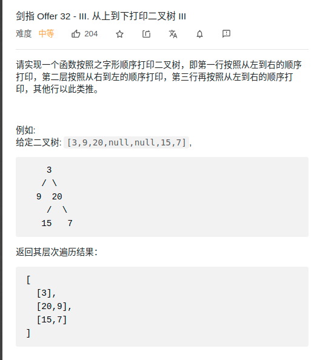

> 思路
- 题目1. 使用一个队列，进行层序遍历
- 题目2. 区分每一层，引入一个变量记录每层节点数的层序遍历
- 题目3. 要求方向交叉，引入deque


> 题目

<div align="center" style="zoom:80%"></div>
<div align="center" style="zoom:80%"></div>
<div align="center" style="zoom:80%"></div>

> 代碼
- 1

```cpp
class Solution {
public:
    vector<int> levelOrder(TreeNode* root) {
        if(root == nullptr) return vector<int>();
        queue<TreeNode*> qu;
        qu.push(root);
        vector<int> res;

        while(!qu.empty()){
            auto t = qu.front();
            qu.pop();
            res.push_back(t->val);
            if(t->left != nullptr) qu.push(t->left);
            if(t->right != nullptr) qu.push(t->right);
        }
        return res;
    }
};
```

- 2
```cpp
class Solution {
public:
    vector<vector<int>> levelOrder(TreeNode* root) {
        if(root == nullptr) return vector<vector<int>>();
        queue<TreeNode*> qu;
        qu.push(root);
        vector<vector<int>> res;
        int sum;

        while(!qu.empty()){
            sum = qu.size();
            vector<int> subres;
            while(sum > 0) {
                --sum;
                auto t = qu.front();
                qu.pop();
                subres.push_back(t->val);
                if(t->left != nullptr) qu.push(t->left);
                if(t->right != nullptr) qu.push(t->right);
            }
            res.push_back(subres);
        }
        return res;
    }
};
```


- 3 


```cpp
class Solution {
public:
    vector<vector<int>> levelOrder(TreeNode* root) {
        if(root == nullptr) return vector<vector<int>>();
        deque<TreeNode*> de;
        de.push_back(root);
        vector<vector<int>> res;
        int sum;
        bool flag = true;//

        while(!de.empty()){
            sum = de.size();
            vector<int> subres;
            while(sum){
                
                if(flag){
                    auto t = de.back(); de.pop_back();
                    subres.push_back(t->val);
                    if(t->left != nullptr) de.push_front(t->left);
                    if(t->right != nullptr) de.push_front(t->right);
                cout << t->val << " ";
                }else{
                    auto t = de.front(); de.pop_front();
                    subres.push_back(t->val);
                    if(t->right != nullptr) de.push_back(t->right);
                    if(t->left != nullptr) de.push_back(t->left);
                cout << t->val << " ";
                }
                --sum;
            }
            cout << endl;
            res.push_back(subres);
            flag = !flag;
        }
        return res;
    }
};
```