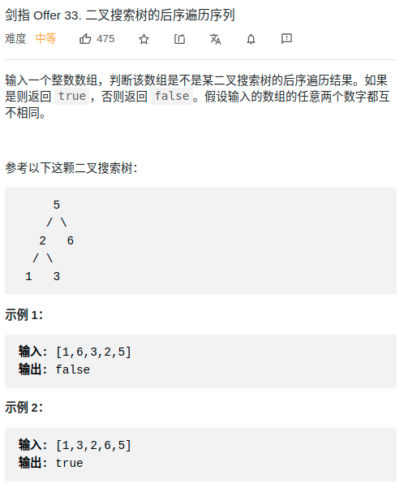

> 难度：简单
- 使用了二叉搜索数的性质，将其转换为判断二叉搜索数合法性问题
- 可以假设是BST，然后利用性质划分左右子树

> 题目
<div align="center" style="zoom:80%"></div>


> 代码

```cpp
class Solution {
public:
    bool verifyPostorder(vector<int>& postorder) {
        if(postorder.size() == 0) return true;
        int ma = postorder[0],mi = postorder[0];
        for(auto a :postorder){
            ma = ma < a ? a : ma;
            mi = mi > a ? a : mi;
        }
        return check(postorder, 0, postorder.size(), mi, ma);
    }

    // 判断合法性(通过值区间[start，limit])，并划分子树。[lo,hi)
    bool check(vector<int>& nums, int lo, int hi, int start, int limit){
        if(lo >= hi) return true;
        int root = hi-1;

        // 1. 判断根合法性
        if(nums[root] > limit || nums[root] < start) return false;

        int split = root-1;
        // 2. 判断子节点合法性，并划分子树
        while(split >= 0 && nums[split] > nums[root]){
            if(nums[split] > limit || nums[split] < start) return false;
            --split;
        }

        // 3. 判断左右子树的合法性
        return check(nums, lo, split+1, start, nums[root]-1)
            && check(nums, split+1, root, nums[root]+1, limit);
    }
};

```
