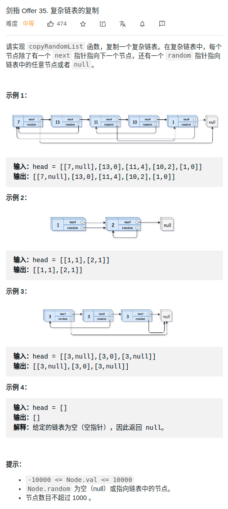

> 难度：简单
- 使用一个map来记录指针到指针的映射

> 题目
<div align="center" style="zoom:80%"></div>

> 代码
```cpp

class Solution {
public:
    Node* copyRandomList(Node* head) {
        Node* it = head;
        Node* res = nullptr;
        Node* resit = nullptr;
        // 1. init and deal next
        while(it != nullptr){
            if(res == nullptr){
                res = new Node(it->val);
                resit = res;
            }else{
                resit->next = new Node(it->val);
                resit = resit->next;
            }
            record[it] = resit;
            it = it->next;
        }

        // 2. 处理 rand
        it = head;
        resit = res;
        while(it != nullptr){
            if(it->random != nullptr){
                resit->random = record[it->random];
            }
            resit = resit->next;
            it = it->next;
        }
        return res;
    }

private:
    unordered_map<Node*,Node*> record;
};
```