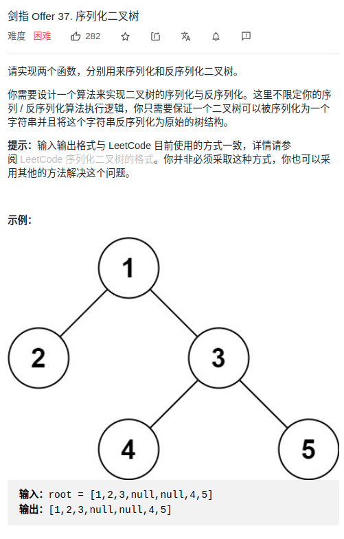

> 难度：简单
- 在 树的note 里已有总结

> 题目
<div align="center" style="zoom:80%"></div>

> 代码

```cpp
class Codec {
public:

    // Encodes a tree to a single string.
    string serialize(TreeNode* root) {
        if(root == nullptr) return "#";
        return to_string(root->val) + ',' + serialize(root->left) + ',' + serialize(root->right);
    }

    // Decodes your encoded data to tree.
    TreeNode* deserialize(string data) {
        list<string> items;
        // 1. 切割
        int it = 0;
        while(it < data.size()){
            auto p = data.find_first_of(',',it);
            items.push_back(data.substr(it,p-it));
            if(p != data.npos)
                it = ++p;
            else
                break;
        }
        return deserialize_(items);
    }

    TreeNode* deserialize_(list<string>& items){
        // 1. 取第一个为根
        auto t = items.front();
        items.pop_front();
        if(t == "#") return nullptr;
        auto root = new TreeNode(atoi(t.c_str()));

        // 2. 左右子树
        auto left = deserialize_(items);
        auto right = deserialize_(items);

        // 3. 连接左右字数
        root->left = left;
        root->right = right;
        return root;
    }
};
```