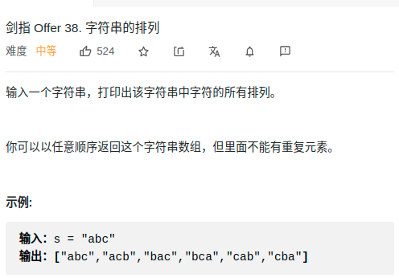

> 难度：简单
- 纯粹的全排列


> 题目
<div align="center" style="zoom:80%"></div>

> 代码

```cpp
class Solution {
public:
    vector<string> permutation(string s) {
        sort(s.begin(), s.end());
        vector<string> res;
        res.push_back(s);
        // 全排列
        /// 1.从右到左找到第一个递增的，如果找不到就退出
        int i = s.length()-2, ii = s.length()-1;
        while(i >= 0){
            if(s[i] >= s[ii]) {
                --i;--ii;
                continue;
            }
            else{
                /// 2. 从右到左找到 比s[i] 大的第一个数，记为j
                int j = s.length()-1;
                while(s[j] <= s[i]) {
                    --j;
                    continue;
                };
                /// 3. swap & reverse
                swap(s[i],s[j]);
                reverse(s.begin()+ii,s.end());
                res.push_back(s);
                i = s.length()-2;
                ii = s.length()-1;
            }
        }
        return res;
    }
};
```