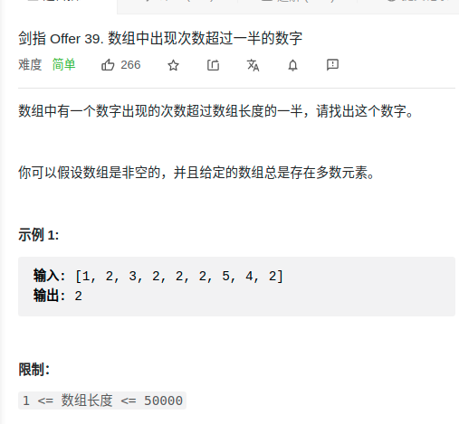

> 难度：简单
- 摩尔投票法

> 题目
<div align="center" style="zoom:80%"></div>


> 代码

```cpp
class Solution {
public:
    int majorityElement(vector<int>& nums) {
        int cur = nums[0];
        int count = 1;
        for(int i = 1; i < nums.size(); ++i){
            if(nums[i] ==cur){
                ++count;
            }else{
                --count;
                if(count <= 0){
                    cur = nums[i];
                    count = 1;
                }
            }
        }
        return cur;
    }
};
```