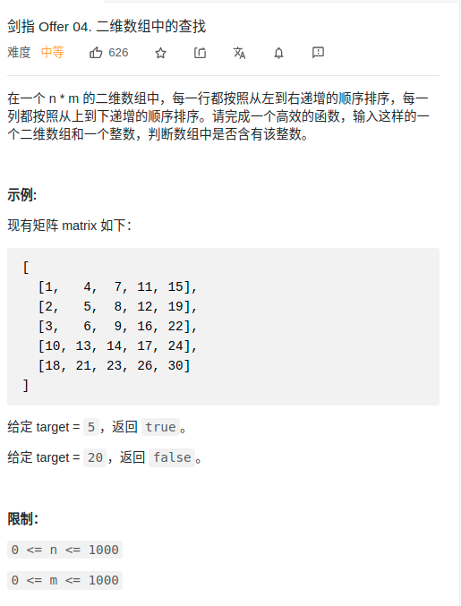

> 难度：简单
- 总结过的了
- 思路
  - 选取可以在两个方向中，一个递减，一个递增的点。

> 题目
<div align="center" style="zoom:80%"></div>


> 代码

```cpp
class Solution {
public:
    bool findNumberIn2DArray(vector<vector<int>>& matrix, int target) {
        // 选取可以在两个方向中，一个递减，一个递增的点。
        int x = matrix.size()-1;
        int y = 0;

        while(x >= 0 && y < matrix[0].size()){
            if(matrix[x][y] == target)
                return true;
            else if(matrix[x][y] > target){
                --x;
            }else{
                ++y;
            }
        }
        return false;
    }
};
```