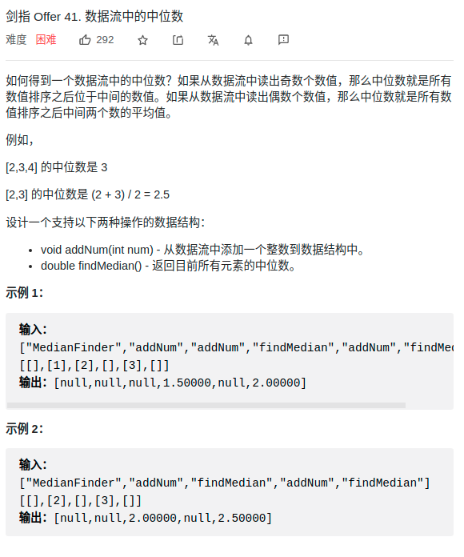

> 难度：简单
- 使用两个优先队列解决


> 题目
<div align="center" style="zoom:80%"></div>

> 代码
```cpp
class MedianFinder {
public:
    /** initialize your data structure here. */
    MedianFinder() {

    }

    void addNum(int num) {
        if(minP.empty()) minP.push(num);
        else if(minP.size() == maxP.size()){
            if(maxP.top() < num){
                // select min
                auto t = maxP.top();
                maxP.pop();
                maxP.push(num);
                num = t;
            }
            minP.push(num);
        }else{
            if(minP.top() > num){
                // select max
                auto t = minP.top();
                minP.pop();
                minP.push(num);
                num = t;
            }
            maxP.push(num);
        }
    }

    double findMedian() {
        if(maxP.size() == minP.size()) return (maxP.top()+minP.top())/2.0;
        else return minP.top();
    }

private:
    priority_queue<int, vector<int>, greater<int>> maxP;
    priority_queue<int,vector<int>, less<int>> minP;

};
```