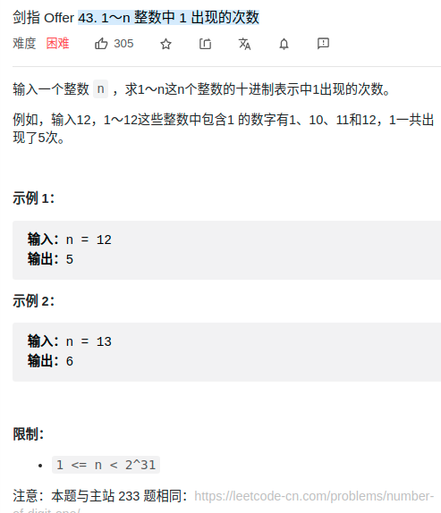
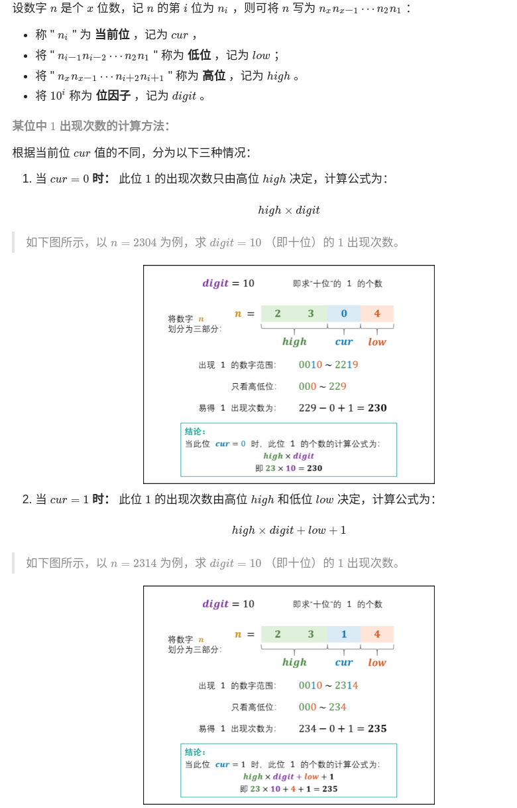
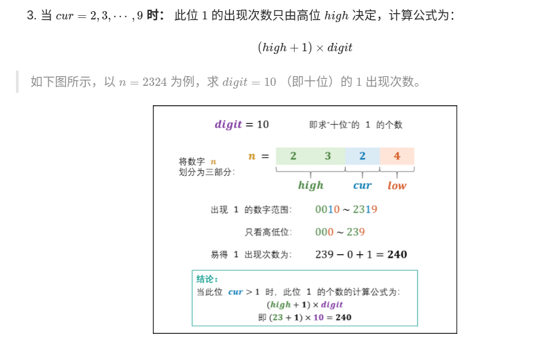

> 难度：中等
- 将 11 ~ nn 的个位、十位、百位、...的 11 出现次数相加，即为 11 出现的总次数
- 

> 题目
<div align="center" style="zoom:80%"></div>
<div align="center" style="zoom:80%"></div>
<div align="center" style="zoom:80%"></div>


> 代码

```cpp
class Solution {
public:
    int countDigitOne(int n) {
        int64_t digit = 1;
        int high = n / 10, cur = n % 10, low = 0;
        int res = 0;
        while(high != 0 || cur != 0){
            if(cur == 0) res = res + high*digit ;
            else if(cur == 1)  res = res + high*digit + low + 1;
            else res = res + (high+1) *digit;

            low = cur*digit + low;
            cur = high %10;
            high /= 10;
            digit *= 10;
        }
        return res;
    }
};
```