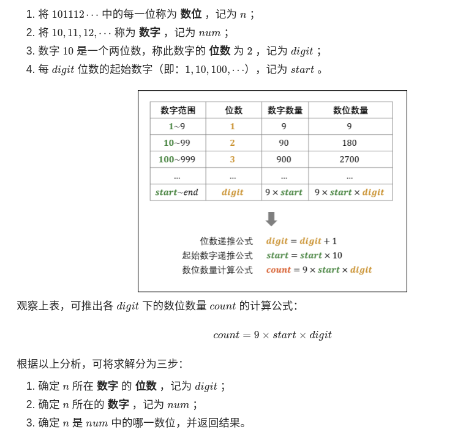
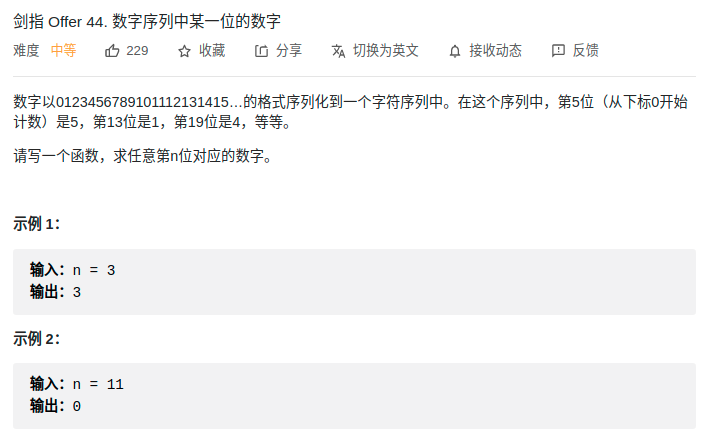

> 难度：中等
- https://leetcode-cn.com/problems/shu-zi-xu-lie-zhong-mou-yi-wei-de-shu-zi-lcof/solution/mian-shi-ti-44-shu-zi-xu-lie-zhong-mou-yi-wei-de-6/


<div align="center" style="zoom:80%"></div>

> 题目

<div align="center" style="zoom:80%"></div>


> 代码

```cpp
class Solution {
public:
    int findNthDigit(int n) {
        int64_t start = 1;
        int64_t dig = 1;
        int64_t count = 9;
        // case1:
        // 2000: 200-10 ==> 190 - 180 ===> 10
        // 10 / 3 =3; 10 % 3 = 1;
        // 100 + 3 == 103  "103"[1] = 0
        // case2:
        // 6: 6/1 = 6; 6 % 1 = 0
        // 0+6 = 6 "6"[0] = 6
        while(n > count){
            n -= count;
            dig++;
            start *= 10;
            count = dig*9*start;
        }
        auto data = start+(n-1)/dig;
        auto dataStr = to_string(data);

        return dataStr[(n-1)%dig] - '0';
    }
};
```