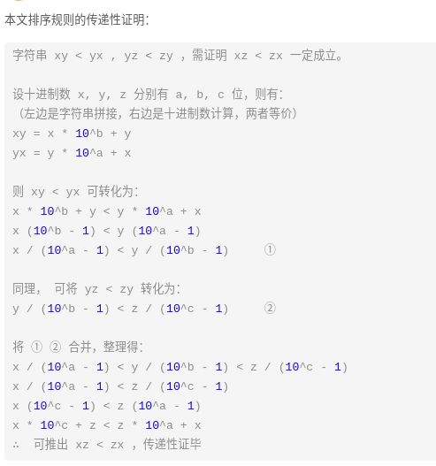

> 难度：中等
- 思路: 此题求拼接起来的最小数字，本质上是一个排序问题。设数组 nums 中任意两数字的字符串为 x 和 y ，则规定 排序判断规则 为：
  - 若拼接字符串 `x + y > y + x` ，则 x “大于” y ；
  - 反之，若 `x + y < y + x` ，则 x “小于” y ；


<div align="center" style="zoom:80%"></div>


> 题目


<div align="center" style="zoom:80%"></div>


> 代码

```cpp
class Solution {
public:
    string minNumber(vector<int> &nums) {
        vector<string> numsStr;
        for(auto a : nums){
            numsStr.push_back(to_string(a));
        }

       sort(numsStr.begin(), numsStr.end(), [](string &a, string &b){
            return a+b < b+a;
       });

        string res;
        for(auto a: numsStr){
            res += a;
        }
        return res;
    }
};
```