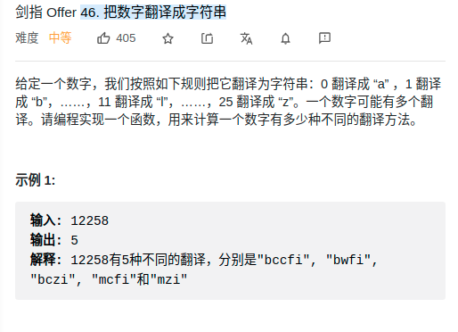

> 难度
- 简单dp

> 题目
<div align="center" style="zoom:80%"></div>

> 代码

```cpp
class Solution {
public:
    int translateNum(int num) {
        string numStr = to_string(num);
        vector<int> dp(numStr.size()+1,1);
        int pos = 1;
        for(int i = 1; i < numStr.size();++i){
            dp[i+1] = dp[i];
            if(numStr[i-1] == '1' || (numStr[i-1] == '2' && numStr[i] < '6')){
                dp[i+1] += dp[i-1];
            }
        }
        return dp[numStr.size()];
    }
};
```