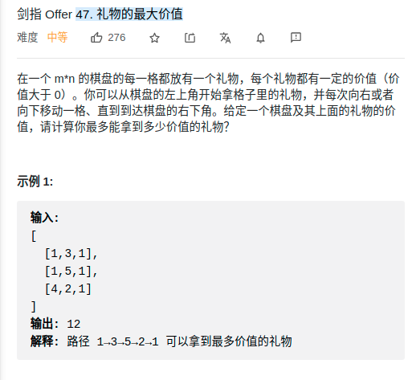

> 难度：中等
- 对角线遍历 + dp


> 题目


<div align="center" style="zoom:80%"></div>

> 代码

```cpp
class Solution {
public:
    int maxValue(vector<vector<int>>& grid) {
        int x = grid.size()-1, y = grid[0].size()-1;
        int flag = x+y;
        while(flag>=0){
            while(x >= 0 && y < grid[0].size()) {
                if (x == grid.size()-1 && y == grid[0].size()-1) {
                } else if (x == grid.size()-1) {
                    grid[x][y] += grid[x][y + 1];
                } else if (y == grid[0].size()-1) {
                    grid[x][y] += grid[x + 1][y];
                } else {
                    grid[x][y] += max(grid[x][y + 1], grid[x + 1][y]);
                }
                --x;
                ++y;
            }
            flag--;
            if(flag >= grid.size()-1) x = grid.size()-1;
            else x = flag;
            y = flag - x;
        }
        return grid[0][0];
    }
};
```