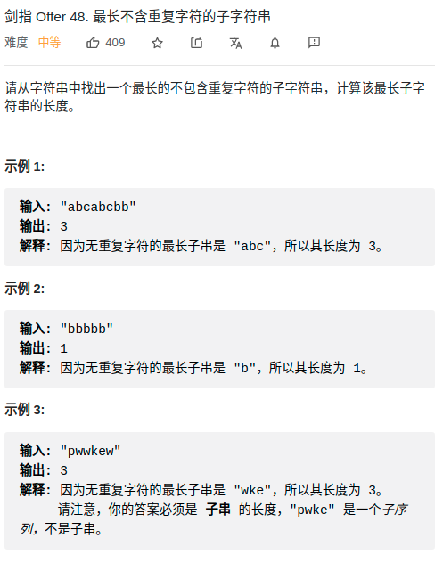

> 难度：中等
- 滑动窗口


> 题目
<div align="center" style="zoom:80%"></div>


> 代码

```cpp
class Solution {
public:
    int lengthOfLongestSubstring(string s) {
        int left, right;
        unordered_map<char, int> window;
        int res=0;
        left = 0;
        right = 0;

        while(right < s.size()){
            
            char c = s[right];
            ++right;
            // update
            ++window[c];

            // 存在重复的
            while(window.size() < right - left){
                char c = s[left];
                ++left;
                --window[c];
                if(window[c] == 0)
                    window.erase(c);
            }
            if(right - left > res) res = right-left;

        }
        return res;
    }
};
```