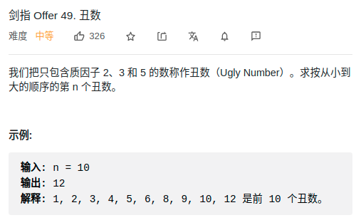

> 难度：中等
- DP


> 题目

<div align="center" style="zoom:80%"></div>

> 代码

```cpp
class Solution {
public:
    int nthUglyNumber(int n) {
        int a, b, c;
        vector<int> dp(n+1);
        // 从1开始
        a = 1; b = 1; c = 1;
        dp[1] = 1;
        int i = 2;
        while(i <= n){
            int next = min(min(dp[a] * 2, dp[b] * 3),dp[c] * 5);
            // 算出下一个丑数
            dp[i] = next;

            // 将相等移位class Solution {
public:
    int nthUglyNumber(int n) {
        int a, b, c;
        vector<int> dp(n+1);
        a = 1; b = 1; c = 1;
        dp[1] = 1;
        int i = 2;
        while(i <= n){
            int next = min(min(dp[a] * 2, dp[b] * 3),dp[c] * 5);
            dp[i] = next;
            if(dp[i] == dp[a] * 2) ++a;
            if(dp[i] == dp[b] * 3) ++b;
            if(dp[i] == dp[c] * 5) ++c;
            ++i;
        }
        return dp[n];
    }
};
            if(dp[i] == dp[a] * 2) ++a;
            if(dp[i] == dp[b] * 3) ++b;
            if(dp[i] == dp[c] * 5) ++c;
            ++i;
        }
        return dp[n];
    }
};
```