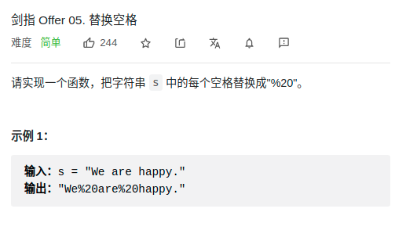

> 难度：简单
- 思路
  1. 重新分配一个字符串
  2. **原地resize，后原地修改**
     1.  计算需要将字符串扩展到多大
     2.  双指针原地字符转移


> 题目

<div align="center" style="zoom:80%"></div>


> 代码
```cpp
class Solution {
public:
    string replaceSpace(string s) {
        // 1. 计算需要将字符串扩展到多大
        int p1 = s.size()-1;
        int sz = s.size();
        for(auto &a : s){
            if(a == ' ')
                sz += 2;
        }
        s.resize(sz);

        // 2. 双指针原地字符转移
        int p2 = sz-1;
        while(p1 >= 0){
            if(s[p1] != ' ')
                s[p2--] = s[p1--];
            else{
                s[p2--] = '0'; s[p2--] = '2'; s[p2--] = '%';
                p1--;
            }
        }
        return s;
    }
};
```