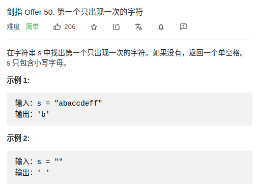

> 难度：简单
- hashMap

> 题目

<div align="center" style="zoom:80%"></div>

> 代码

```cpp
class Solution {
public:
    char firstUniqChar(string s) {
        unordered_map<char, int> record;
        for( auto a : s ){
            ++record[a];
        }
        for(auto a: s){
            if(record[a] == 1)
                return a;
        }
        return ' ';
    }
};
```