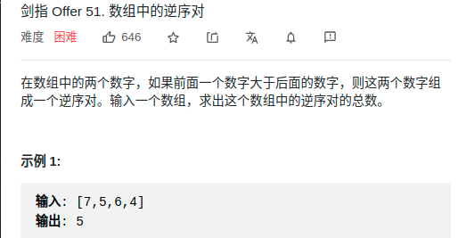

> 难度：中等
- 主要是想到归并排序这一步比较难

> 题目


<div align="center" style="zoom:80%"></div>

> 代码

```cpp
class Solution {
public:
int reversePairs(vector<int>& nums) {
    temp.resize(nums.size());
    sort(nums, 0, nums.size());
    return res;
}


vector<int> temp;
int res = 0;
// [lo, hi)
void sort(vector<int>& nums, int lo, int hi){
    if(lo+1 >= hi) return;

    int mid = (lo + hi) /2;
    sort(nums, lo, mid);
    sort(nums, mid, hi);
    merge(nums,lo,mid,mid,hi, temp);
}

void merge(vector<int>&nums, int lo1, int hi1, int lo2, int hi2, vector<int>&temp){
    int start, end, it;
    start = lo1; it = lo1; end = hi2;
    while(lo1 < hi1 && lo2 < hi2){
        if(nums[lo1] <= nums[lo2])
            temp[it++] = nums[lo1++];
        else{
            res += (hi1-lo1);
            temp[it++] = nums[lo2++];
        }
    }
    while(lo1 < hi1){
        temp[it++] = nums[lo1++];
    }
    while(lo2 < hi2){
        temp[it++] = nums[lo2++];
    }


    for(int i = start; i < end; ++i){
        nums[i] = temp[i];
    }

}

};
```