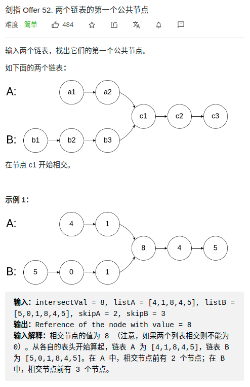

> 难度：简单
- 双指针
> 题目

<div align="center" style="zoom:80%"></div>

> 代码

```cpp
class Solution {
public:
    ListNode *getIntersectionNode(ListNode *headA, ListNode *headB) {
        if(headA == NULL || headB == NULL) return NULL;
        ListNode *it1, *it2;
        it1 = headA;
        it2 = headB;
        while( it1 != it2){
            
            it1 = it1->next;
            it2 = it2->next;
            if(it1 == NULL && it2 == NULL) return NULL;
            if(it1 == NULL) it1 = headB;
            if(it2 == NULL) it2 = headA;
        }
        return it1;
    }
};
```