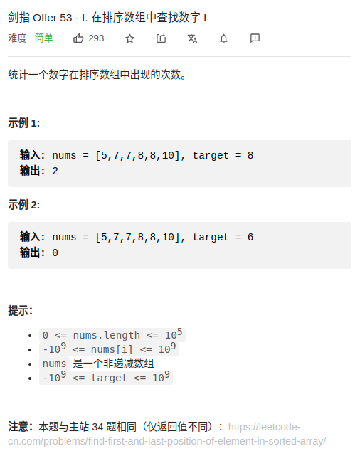

> 难度：简单
- 二分

> 题目

<div align="center" style="zoom:80%"></div>

> 代码

```cpp
int binary_left(vector<int>& nums, int target){
    int lo = 0;
    int hi = nums.size();
    while(lo < hi){
        int mid = (lo + hi)/2;
        if(nums[mid] == target){
            hi = mid;
        }else if( nums[mid] < target){
            lo = mid+1;
        }else if( nums[mid] > target){
            hi = mid;
        }
    }
    return hi;

}
int binary_right(vector<int>& nums, int target){
    int lo = 0;
    int hi = nums.size();
    while(lo < hi){
        int mid = (lo + hi)/2;
        if(nums[mid] == target){
            lo = mid+1;
        }else if( nums[mid] < target){
            lo = mid+1;
        }else if( nums[mid] > target){
            hi = mid;
        }
    }
    return hi;
}


class Solution {
public:
    int search(vector<int>& nums, int target) {
        return binary_right(nums, target) - binary_left(nums,target);
    }
};
```
