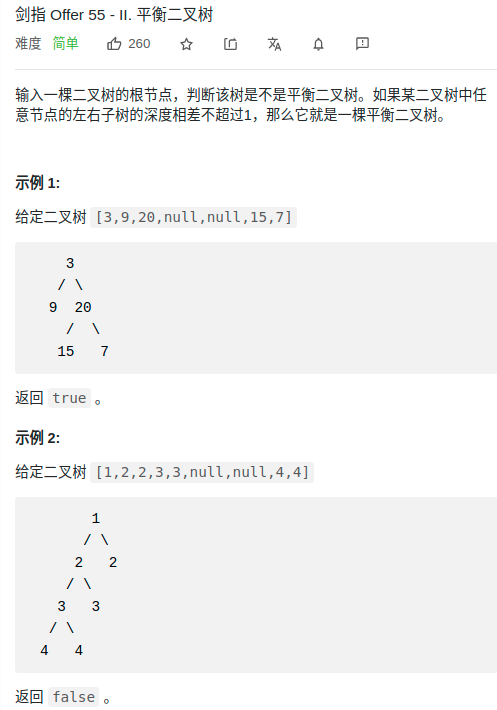

> 难度：简单


> 题目

<div align="center" style="zoom:80%"></div>

> 代码

```cpp
class Solution {
public:
    int maxDepth(TreeNode* root) {
        if(root == nullptr) return 0;
        return max(maxDepth(root->left), maxDepth(root->right))+1;
    }
};
```