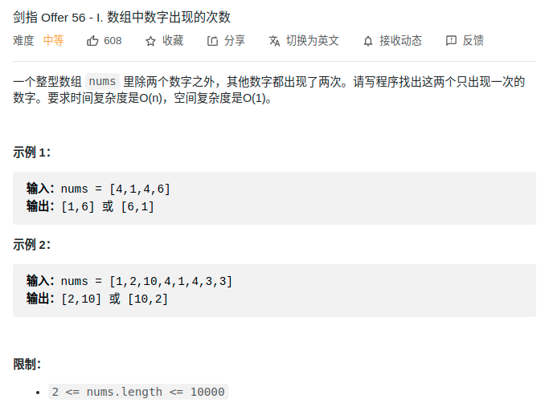

> 难度：中等
- https://leetcode-cn.com/problems/shu-zu-zhong-shu-zi-chu-xian-de-ci-shu-lcof/solution/jian-zhi-offer-56-i-shu-zu-zhong-shu-zi-tykom/
  
- 要点：如果只有一个只出现一次，异或一次就够了
  - 将问题转化成该问题就行了

> 题目
<div align="center" style="zoom:80%"></div>


> 代码

```cpp
class Solution {
public:
    vector<int> singleNumbers(vector<int>& nums) {
        // 1. 设两个数分别为x和y，全部异或
        int xy = 0;
        for(auto n : nums){
            xy ^= n;
        }
        // 2. 获取 x 和 y 第一位不同的位
        int m = 1;
        while((m & xy) == 0){
            m <<= 1;
        }
        cout << m;
        // 3. 分组异或
        int g1 = 0,g2 = 0;
        for(auto n : nums){
            if((n & m))
                g1 ^= n;
            else
                g2 ^= n;
        }
        return {g1,g2};
    }
};
```