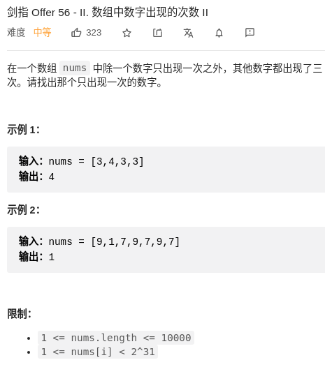

> 难度：中等
- 摆烂用hashmap
- 实际上是位运算，但是我赌不会考
  - 解法太巧妙，不是通解

> 题目

<div align="center" style="zoom:80%"></div>

> 代码

```cpp
class Solution {
public:
    int singleNumber(vector<int>& nums) {
        unordered_map<int,int> record;
        for(auto a: nums){
            ++record[a];
        }
        for(auto a : record){
            if(a.second == 1)
                return a.first;
        }
        return 0;
    }
};
```