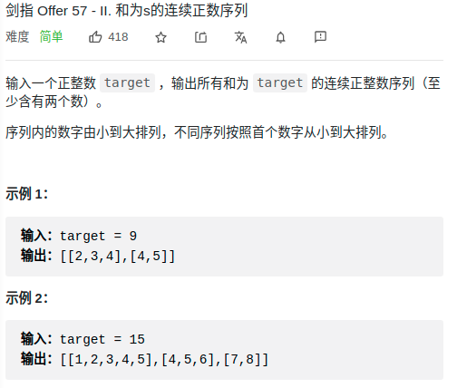

> 难度：简单
- 等差+滑动窗口


> 题目
<div align="center" style="zoom:80%"></div>

> 代码

```cpp
class Solution {
public:
    vector<vector<int>> findContinuousSequence(int target) {
        int left=1, right=1;
        vector<vector<int>> res;
        while(right < target){
            int cal = ((left+right)*(right-left+1))/2;
            if(cal == target){
                vector<int> temp;
                for(int i = left; i <= right; ++i){
                    temp.push_back(i);
                }
                res.push_back(temp);
                ++left;
            }else if(cal < target){
                ++right;
            }else if(cal > target){
                ++left;
            }
        }
        return res;
    }
};
```