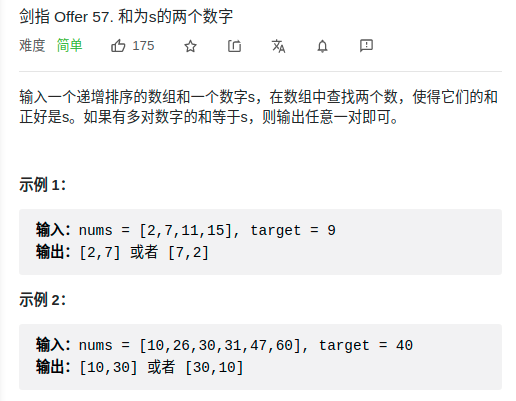

> 难度：简单
- 双指针


> 题目
<div align="center" style="zoom:80%"></div>

> 代码

```cpp
class Solution {
public:
    vector<int> twoSum(vector<int>& nums, int target) {
        int left = 0;
        int right = nums.size()-1;
        while(left < right){
            if(nums[left] + nums[right] < target){
                ++left;
            }else if(nums[left] + nums[right] > target){
                --right;
            }else{
                return vector<int>{nums[left], nums[right]};
            }
        }
        return {};
    }
};
```