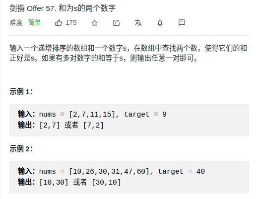

> 难度：简单
- 涉及c++所欠缺的字符串操作

> 题目

<div align="center" style="zoom:80%"></div>

> 代码

```cpp

class Solution {
public:
    // 剔除左右两边的空格
    string trim(string &s){
        int i = 0;
        int j = s.size()-1;
        while(i < s.size() && s[i] == ' ')
            ++i;
        while(j >= 0 && s[j] == ' ')
            --j;
        return s.substr(i,j-i+1);
    }

    vector<string> split(string s, string patt){
        vector<string> res;
        while(true){
            s = trim(s);
            auto next = s.find(patt);
            res.push_back(s.substr(0, next));
            if(next == s.npos)
                break;
            else
                s = s.substr(next+1);
        }
        return res;
    }

    string reverseWords(string s) {
        auto res = split(s," ");
        string resstr;
        for(int i = res.size()-1; i >= 0; --i){
            resstr = resstr + res[i] + ' ';
        }
        resstr = trim(resstr);
        return resstr;
    }
};
```