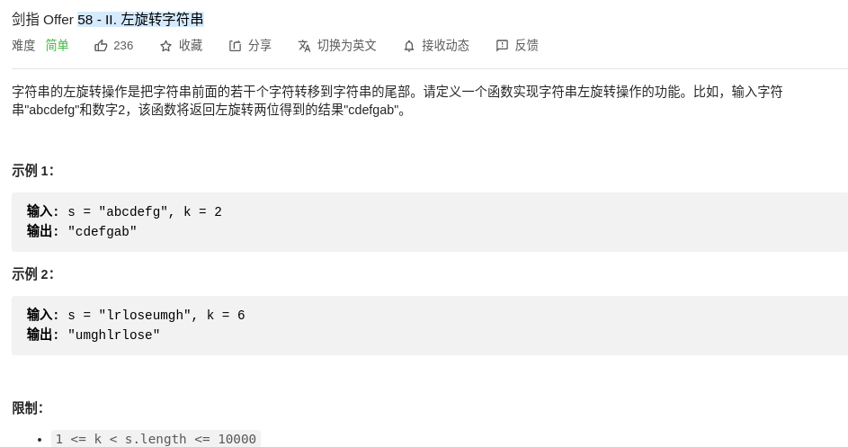

> 难度：简单
- 思路：三次翻转
> 题目
<div align="center" style="zoom:80%"></div>

> 代码

```cpp
class Solution {
public:
    string reverseLeftWords(string s, int n) {
        reverse(s.begin(), s.end());
        reverse(s.begin(), s.begin()+s.size()-n);
        reverse(s.begin()+s.size()-n, s.end());
        return s;
    }
};
```