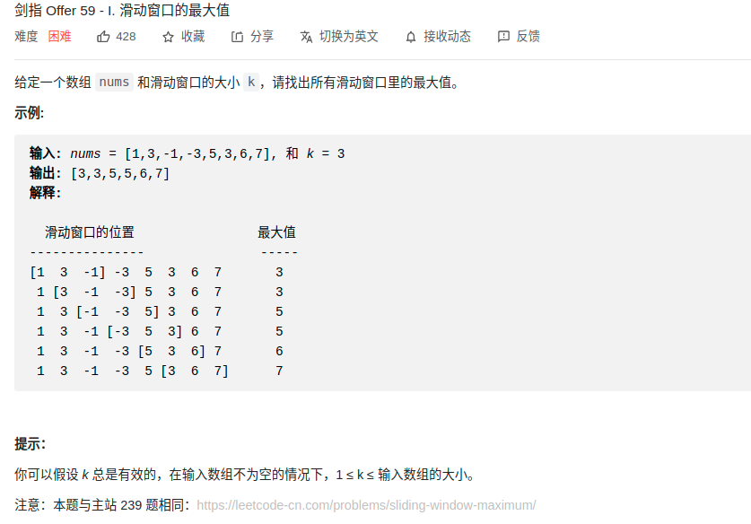

> 难度：中等
- 做过的题目，用单调队列求解即可

> 题目
<div align="center" style="zoom:60%"></div>

> 代码

```cpp
class Solution {
public:
    class myqueue{
    public:
        void push(int n){
            while(!q.empty() && q.back() < n) q.pop_back();
            q.push_back(n);
        }
        void pop(int n){
            if(q.front() == n) q.pop_front();
        }
        int getMax(){
            return q.front();
        }
    private:
        deque<int> q;
    };
    vector<int> maxSlidingWindow(vector<int>& nums, int k) {
        if(nums.size() == 0) return {};
        vector<int> res;
        myqueue q;
        int left = 0;
        int right = 0;
        while(right < nums.size()){
            if(right-left < k){
                q.push(nums[right]);
            }else{
                res.push_back(q.getMax());
                q.pop(nums[left]);
                ++left;
                q.push(nums[right]);
            }
            ++right;
        }
        res.push_back(q.getMax());
        return res;
    }
};
```