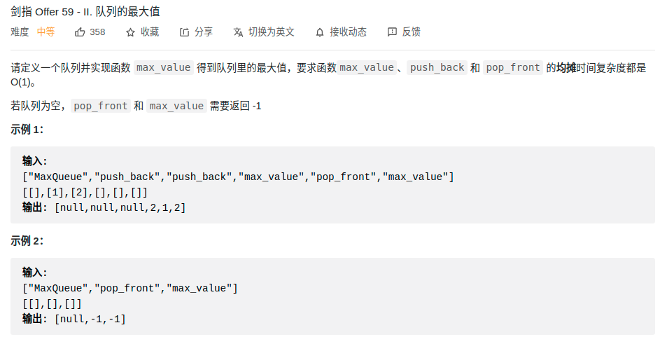

> 难度：简单
- 单调队列
> 题目
<div align="center" style="zoom:80%"></div>

> 代码

```cpp
class MaxQueue {
public:
    MaxQueue() {

    }

    int max_value() {
        if(q_.empty()) return -1;
        return l_.front();
    }

    void push_back(int value) {
        q_.push(value);
        while(!l_.empty() && l_.back() < value) l_.pop_back();
        l_.push_back(value);
    }

    int pop_front() {
        if(q_.empty()) return -1;
        int res = q_.front();
        q_.pop();
        if(res == l_.front()) l_.pop_front();
        return res;
    }

private:
    queue<int> q_;
    deque<int> l_;
};
```