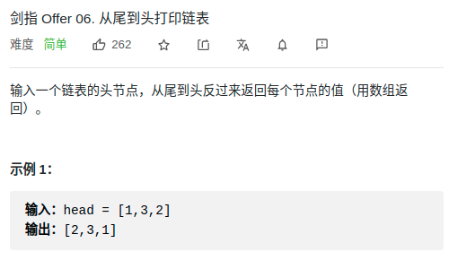

> 题目：简单
- 思路
  1. **递归**
  2. 借助栈 


> 题目
<div align="center" style="zoom:80%"></div>


> 代码

- 递归——后序遍历做法

```cpp
class Solution {
public:
    int n = 0;
    vector<int> reversePrint(ListNode* head) {
        vector<int> res;
        dfs(res, head);
        return res;
    }
    void dfs(vector<int>& res, ListNode* head){
        if(head == NULL){
            res.reserve(n);// 避免频繁 re malloc
            return;
        }
        ++n;
        dfs(res,head->next);
        res.push_back(head->val);
    }
};
```