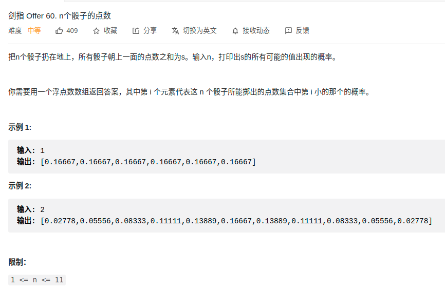

> 难度：中等
- DP
  - 正向扩散


> 题目
<div align="center" style="zoom:60%"></div>

> 代码

```cpp
class Solution {
public:
    vector<double> dicesProbability(int n) {
        // [n,6n]
        vector<double> dp(7, 1.0/6);
        for(int i = 1; i < n; ++i){
            // 处理第 i 个骰子
            vector<double> temp(6*n+1,0);
            // 从第i个骰子能达到的某个点数，开始正向扩散
            for(int j = 1*i; j <= 6*i; ++j){
                for(int k = 1; k <= 6; ++k){
                    temp[j+k] += (dp[j] * (1.0/6));
                }
            }
            dp = temp;
        }
        return vector<double>(dp.begin()+n,dp.end());
    }
};
```
