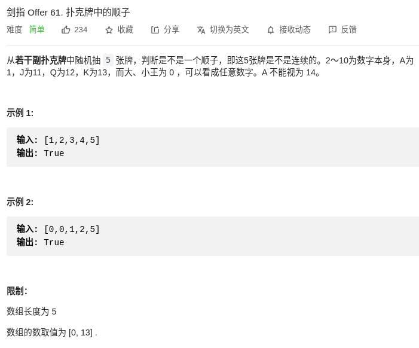

> 难度：中等
- 做法多，细节多
> 题目

<div align="center" style="zoom:60%"></div>

> 代码

```cpp
class Solution {
public:
    bool isStraight(vector<int>& nums) {
        sort(nums.begin(), nums.end());
        int zeroNum = 0;
        int base = 0;
        for(int i = 0; i < nums.size(); ++i){
            if(nums[i] == 0) zeroNum++;
            else{
                if(base == 0) base = nums[i];
                if(i < nums.size()-1 && nums[i] == nums[i+1]) return false;
            }
        }
        // 已经保证不会重复了
        return nums[4] - base < 5;
    }
};
```