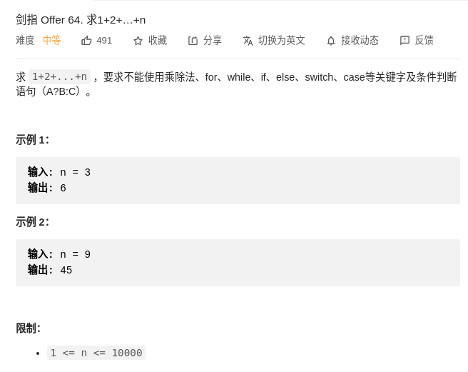

> 思路
- https://leetcode-cn.com/problems/qiu-12n-lcof/solution/mian-shi-ti-64-qiu-1-2-nluo-ji-fu-duan-lu-qing-xi-/
> 题目
<div align="center" style="zoom:60%"></div>

> 代码

```cpp
class Solution {
public:
    int sumNums(int n) {
        n && (n += sumNums(n-1));
        return n;
    }
};
```