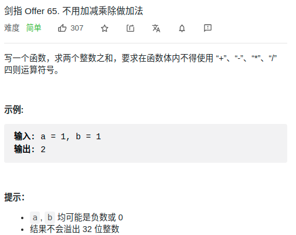

> 难度
- https://leetcode-cn.com/problems/bu-yong-jia-jian-cheng-chu-zuo-jia-fa-lcof/solution/mian-shi-ti-65-bu-yong-jia-jian-cheng-chu-zuo-ji-7/

> 题目
<div align="center" style="zoom:60%"></div>

> 代码

```cpp
class Solution {
public:
    int add(int a, int b) {
        int c = 0;
        while(b){
            c = (unsigned int)(a & b) << 1;
            a ^= b;
            b = c;
        }
        return a;
    }
};
```