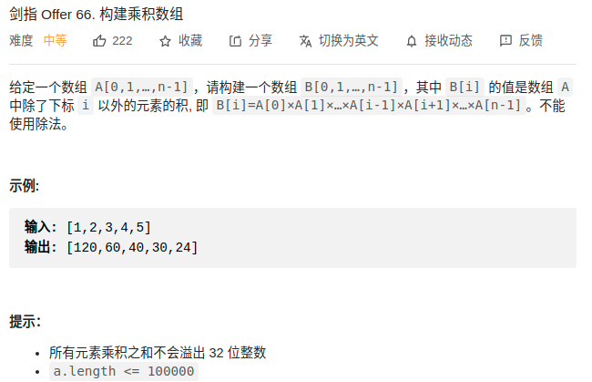

> 难度：中等
- https://leetcode-cn.com/problems/gou-jian-cheng-ji-shu-zu-lcof/solution/mian-shi-ti-66-gou-jian-cheng-ji-shu-zu-biao-ge-fe/
> 题目

<div align="center" style="zoom:60%"></div>


> 代码
```cpp
class Solution {
public:
    vector<int> constructArr(vector<int>& a) {
        if(a.size()==0)return {};
        vector<int> res(a.size(), 1);
        int temp = 1;
        // 下三角
        for(int i = 1; i < a.size(); ++i){
            res[i] = res[i-1]* a[i-1];
        }
        int t = a.back();
        for(int i = a.size()-2; i >= 0; --i){
            res[i] *= t;
            t *= a[i];
        }
        return  res;
    }
};
```