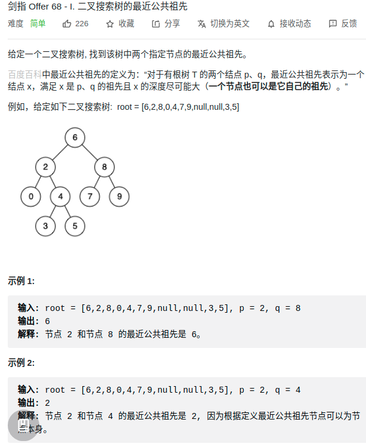

> 难度：简单

> 题目
<div align="center" style="zoom:60%"></div>

> 代码

```cpp
class Solution {
public:
    
    TreeNode* lowestCommonAncestor(TreeNode* root, TreeNode* p, TreeNode* q) {
        dfs(root, p, pathp);
        dfs(root, q, pathq);
        int i = 0;
        while(i < pathp.size() && i < pathq.size() && pathp[i] == pathq[i]) ++i;
        return pathp[i-1];
    }

    vector<TreeNode*> pathp, pathq;
    void dfs(TreeNode* root, TreeNode* p,vector<TreeNode*>& path){
        path.push_back(root);
        if(root->val == p->val)
            return;
        else if(root->val > p->val)
            dfs(root->left, p, path);
        else if(root->val < p->val){
            dfs(root->right, p, path);
        }
        return;
    }
};
```