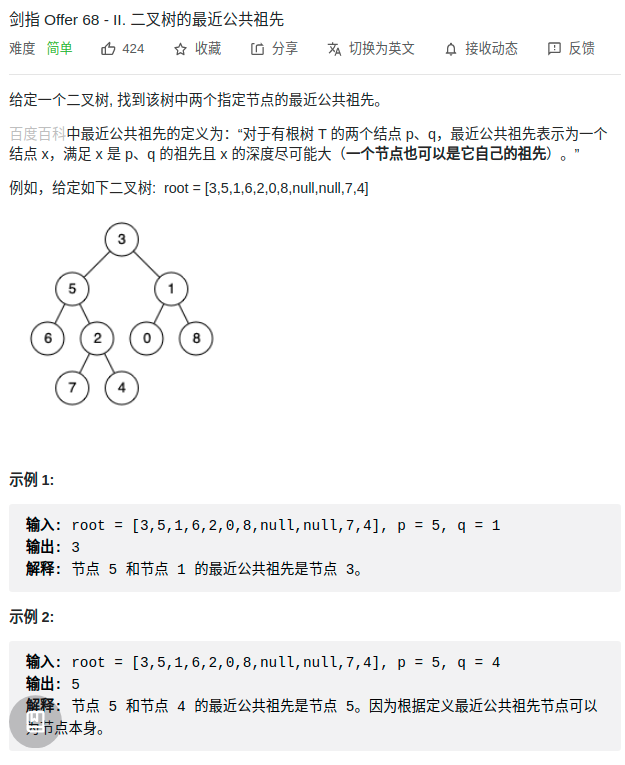

> 难度：简单

> 题目
<div align="center" style="zoom:60%"></div>

> 代码

```cpp
class Solution {
public:
    TreeNode* lowestCommonAncestor(TreeNode* root, TreeNode* p, TreeNode* q) {
        vector<TreeNode*> rcp;
        vector<TreeNode*> rcq;
        bool pres = false, qres =  false;
        find(root, p, rcp, pres);
        find(root, q, rcq, qres);

        // 找最近的
        int posp = rcp.size()-1;
        int posq = rcq.size()-1;
        while(posp >= 0 && posq >= 0){
            if(rcp[posp] == rcq[posq]){
                --posp;
                --posq;
            } else{
                break;
            }
        }
        return rcp[posp+1];
    }

    bool find(TreeNode* root, TreeNode* target, vector<TreeNode*> &record, bool &res){
        if(root == nullptr || res) return res;

        if(root->val == target->val) {
            record.push_back(root);
            return true;
        }
        res = res || find(root->left, target, record, res) ;
        res = res || find(root->right, target, record, res)  ;
        if(res){
            record.push_back(root);
        }
        return res;
    }
};
```