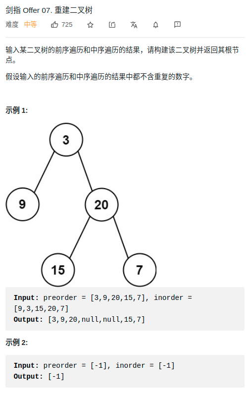

> 难度：简单
- 做过的

> 题目


<div align="center" style="zoom:80%"></div>

> 代码

```cpp
class Solution {
public:
    TreeNode* buildTree(vector<int>& preorder, vector<int>& inorder) {
        return build(preorder, 0, preorder.size()-1, inorder, 0, inorder.size()-1);
    }

    // [lo1,hi1]  [lo2,hi2]
    TreeNode* build(vector<int>& preorder, int lo1, int hi1, vector<int>& inorder, int lo2, int hi2){
        if(lo1 > hi1 || lo2 > hi2) return nullptr;
        // 1. 先拿root
        auto root = new TreeNode(preorder[lo1]);

        int pos = lo2;
        while(pos <= hi2 && inorder[pos] != preorder[lo1] && ++pos);

        auto leftLen = pos - lo2;

        root->left = build(preorder, lo1+1, lo1+leftLen, inorder, lo2, lo2+leftLen-1);

        root->right = build(preorder, lo1+leftLen+1, hi1, inorder, pos+1, hi2);
        return root;
    }

};

```