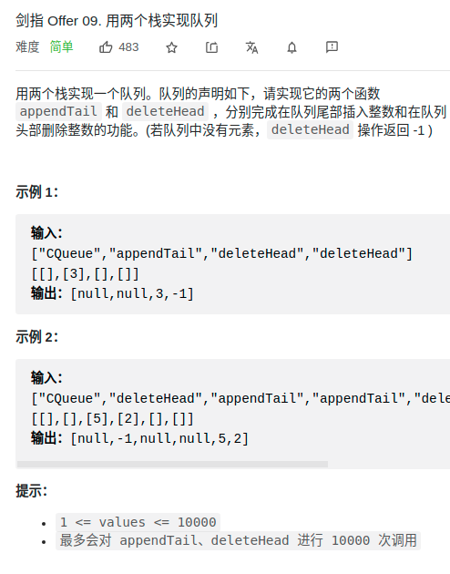

> 难度：简单

- 巧用栈

> 题目
<div align="center" style="zoom:80%"></div>


> 代码

```cpp
class CQueue {
public:
    CQueue() {

    }

    void appendTail(int value) {
        sin.push(value);
    }

    int deleteHead() {
        if(sout.empty() && sin.empty()) return -1;
        if(sout.empty()){
            while(!sin.empty()){
                sout.push(sin.top());
                sin.pop();
            }
        }
        int res= sout.top();
        sout.pop();
        return res;
    }
private:
    // 输入栈，输出栈
    stack<int> sin, sout;
};
```