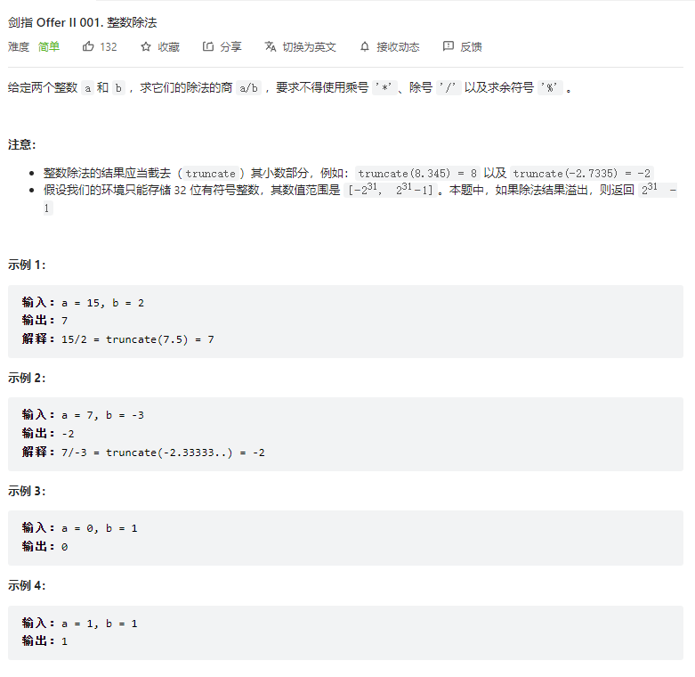

> 难度：中等
- 考察两点：均有模板
  - 二分法：
    - 计算 a/b=c，求c（向下取整） ===> b*c = a
    - 这个时候 b 是固定的，c为所求。二分时注意点如下
      - c 的初始范围 [0, a+1]
      - b*c 单调增
      - 靠左二分法，保证 hi * b > a，退出条件为 `lo < hi`, 所以最终退出循环后结果为 lo-1
  - 快速乘法
- 个人理解：**什么时候用快速乘法呢**，主要针对的是那类不让你用 * 来计算乘法的情况，这个时候用快速乘法（移位操作）来解决

> 题目

<div align="center" style="zoom:80%"></div>

> 代码
```cpp
class Solution {
public:
    int divide(int a, int b) {
        bool flag;
        long long x,y;
        if((a < 0 && b < 0) || (a > 0 && b > 0) ) flag = false;
        else flag = true;

        x = a; y = b;
        if(x < 0) x = -x;
        if(y < 0) y = -y;
        if(a == 0) return 0;

        long long lo,hi;
        lo = 0, hi = x+1;
        while(lo < hi){
            long long mid = lo + (hi-lo)/2;
//            cout << lo << " " << hi <<endl;
            auto temp = mul(mid,y);
            if( temp == x ){
                if(-mid == INT32_MIN)
                    return flag ? INT32_MIN:INT32_MAX;
                else
                    return flag? -mid :mid;
            }else if(temp < x){
                lo = mid + 1;
            }else if(temp > x){
                hi = mid;
            }
        }
        if(-(lo-1) == INT32_MIN)
        return flag ? INT32_MIN:INT32_MAX;
        else
            return flag? -(lo-1) :lo-1;
    }
    // 快速乘法(用于不让使用*), 计算a*b，必须保证 a b 都为正整数
    long long mul(long long a, long long b){
        long long res = 0;
        while(b != 0){
            if ((b & 1) == 1)
                res += a;
            a += a;
            b >>= 1;
        }
        return res;
    }
};

```
