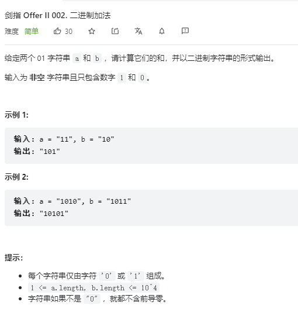

> 难度：简单
- 简单的字符串操作，if else

> 题目
<div align="center" style="zoom:100%"></div>


> 代码

```cpp
class Solution {
public:
    inline int getInt(char a){
        if( a == '1') return 1;
        else return 0;
    }
    string addBinary(string a, string b) {
        reverse(a.begin(), a.end());
        reverse(b.begin(), b.end());
        int add = 0;
        int it1 = 0,it2 = 0;
        string res;
        while(it1 < a.size() || it2 < b.size()){
            int t;
            if(it1 < a.size() && it2<b.size())
                t = getInt(a[it1++]) + getInt(b[it2++])+ add;
            else if(it1 < a.size() && it2 >= b.size())
                t = getInt(a[it1++]) + add;
            else
                t = getInt(b[it2++])+ add;
            if( t == 0 ){
                res.push_back('0');
                add = 0;
            }else if(t == 1){
                res.push_back('1');
                add = 0;
            }else if(t == 2){
                res.push_back('0');
                add = 1;
            }else if(t == 3){
                res.push_back('1');
                add = 1;
            }
        }
        if(add == 1)
            res.push_back('1');
        reverse(res.begin(),res.end());
        return res;
    }
};
```