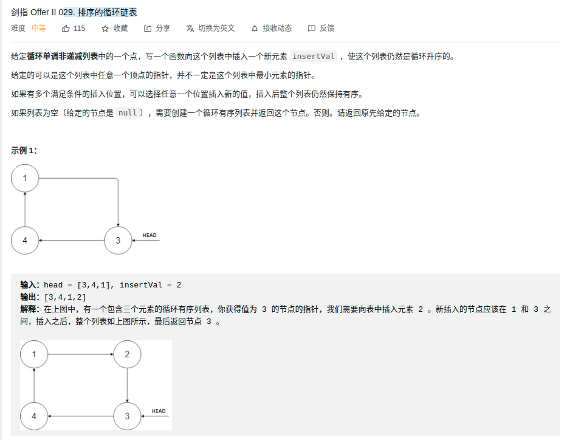

> 难度：中等
- 许多case需要考虑，建议画图

> 题目


<div align="center" style="zoom:100%"></div>

> 代码

```go

type Node struct {
	Val  int
	Next *Node
}

func insert(aNode *Node, x int) *Node {
	if aNode == nil {
		rtn := &Node{x, nil}
		rtn.Next = rtn
		return rtn
	}
	rtn := aNode
	for {
		if aNode.Next == rtn {
			// conner case：跑了一圈了，还是没有找到，直接在当前插入
			t := &Node{x, aNode.Next}
			aNode.Next = t
			break
		} else if aNode.Val > aNode.Next.Val {
			// 断层，说明是递增临界点，如果x是最大或者最小的，则在此插入
			if aNode.Next.Val >= x || aNode.Val <= x {
				t := &Node{x, aNode.Next}
				aNode.Next = t
				break
			}
		} else {
			// 非断层，普通情况，如果满足递增，就插入
			if aNode.Val <= x && x <= aNode.Next.Val {
				t := &Node{x, aNode.Next}
				aNode.Next = t
				break
			}
		}
		aNode = aNode.Next
	}
	return rtn

}

```