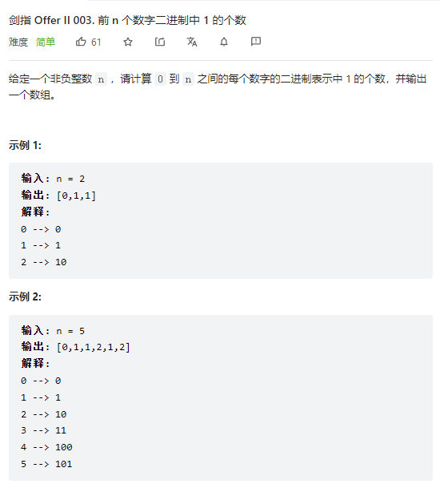

> 难度：中等
- 状态：
  - 状态1：第 i 个数
- 选择：只有一个选择（o(1)）
  - 选取 除去最高位，剩余位数表示的数 中有多少个 1，在其结果的基础上+1，就是当前结果
- base case:0
- 状态转移方程：
  - 综上：dp[i] = dp[i-highbit] + 1

> 题目
<div align="center" style="zoom:100%"></div>

> 代码

```cpp
class Solution {
public:
    vector<int> countBits(int n) {
        vector<int> res(n+1,0);
        int highbit = 0;
        for(int i = 1; i <= n; ++i){
            if((i&(i-1)) == 0){
                highbit = i;
            }
            res[i] = res[i-highbit] + 1;
        }
        return res;
    }
};
```