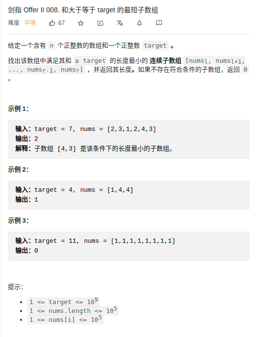

> 难度：简单
- 滑动窗口，简单套路

> 题目


<div align="center" style="zoom:100%"></div>

> 代码

```cpp
class Solution {
public:
    int minSubArrayLen(int target, vector<int>& nums) {
        int lo,hi;
        lo = 0; hi = 0;
        int res = nums.size()+1;
        int now = nums[hi];
        
        while(hi < nums.size()-1){
            // 收缩
            while(now >= target){
                // 记录结果
                res = res > hi-lo+1 ? hi-lo+1 : res;
                now -= nums[lo];
                ++lo;
            }
            // 扩张
            now += nums[++hi];
        }

        // 补丁
        while(now >= target){
            res = res > hi-lo+1 ? hi-lo+1 : res;
            now -= nums[lo];
            ++lo;
        }

        return res == nums.size()+1 ? 0 : res;
    }
};
```