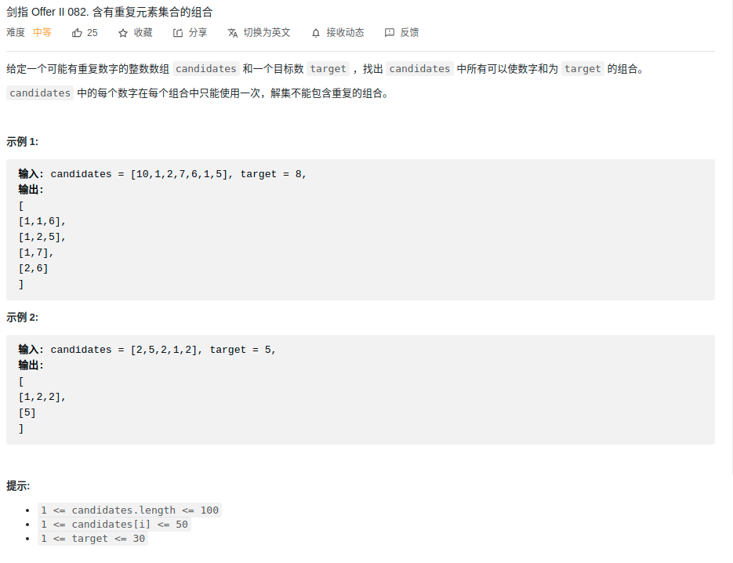

> 难度：中等
- DFS：
  - 如何减少dfs的复杂度，值得思考

> 题目


<div align="center" style="zoom:80%"></div>


> 代码

```cpp
class Solution {
public:
    vector<vector<int>> res;
    unordered_map<int,int> record;
    vector<vector<int>> combinationSum2(vector<int>& candidates, int target) {
        sort(candidates.begin(),candidates.end());
        for(auto c : candidates){
            ++record[c];
        }
        vector<int > status;
        dfs(status, candidates, 0,target);
        return res;
    }
    // 让每一层，只处理一种数，避免重复和复杂度
    void dfs(vector<int>& status,vector<int>& data, int start,int target){
        if(start == data.size() && target == 0){
            res.push_back(status);
            return;
        }
        if(start == data.size())
            return;

        if(target < data[start])return;
        for(int i = 0; i <= record[data[start]]; ++i){
            for(int j = 0;j < i; ++j){
                status.push_back(data[start]);
            }
            dfs(status,data,start+record[data[start]],target-data[start]*i);
            for(int j = 0;j < i; ++j){
                status.pop_back();
            }
        }
    }
};
```