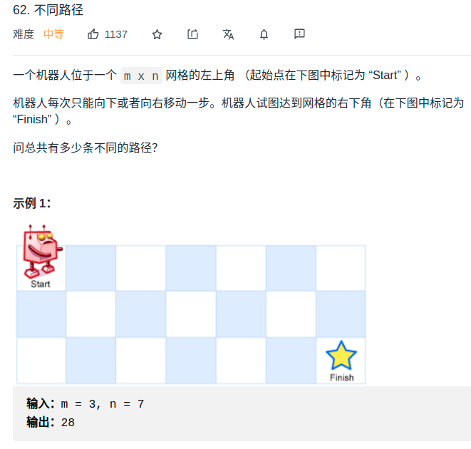

> 难度：简单


> 题目
<div align="center" style="zoom:80%"></div>

> 代码

```cpp
class Solution {
public:
    int uniquePaths(int m, int n) {
        vector<vector<int>> dp(m,vector<int>(n,1));
        for(int i = 1; i < m; ++i){
            for(int j = 1; j < n; ++j){
                dp[i][j] = dp[i-1][j] + dp[i][j-1];
            }
        }
        return dp[m-1][n-1];
    }
};
```