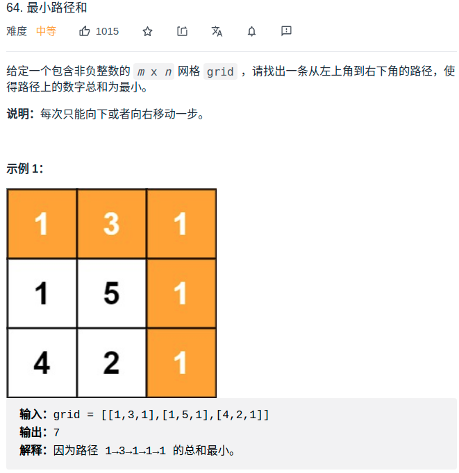

> 难度：简单
- 动态规划
> 题目
<div align="center" style="zoom:80%"></div>

> 代码

```cpp
class Solution {
public:
    int minPathSum(vector<vector<int>>& grid) {
        return dpdeal(grid);
    }

    // 法2：dp
    int dpdeal(vector<vector<int>> &grid){
        vector<vector<int>> dp(grid.size()+1,vector<int>(grid[0].size()+1, 500001));
        for(int i = 0; i < grid.size(); ++i){
            for(int j = 0; j < grid[0].size(); ++j){
                if(i==0 && j == 0){
                    dp[i+1][j+1] = grid[i][j];
                }else{
                    dp[i+1][j+1] = min(dp[i][j+1], dp[i+1][j]) + grid[i][j];
                }
            }
        }
        return dp[grid.size()][grid[0].size()];
    }
};
```