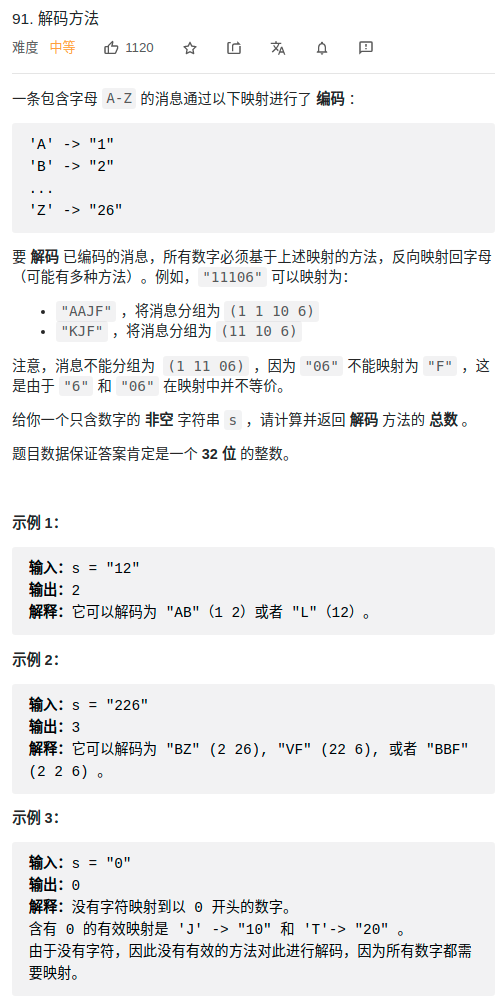

> 难度：中等
- dp[i]:s.substr[0,i]能够编码的个数
> 题目
<div align="center" style="zoom:80%"></div>

> 代码

```cpp
class Solution {
public:

    int numDecodings(string s) {
        if(s[0] == '0') return 0;
        int dp[105]{0};
        dp[1] = 1;
        dp[0] = 1;
        // 从第二个字符开始处理
        for(int i = 1;i < s.length(); ++i){
            // 先判断是不是0
            if(s[i] == '0'){
                // 判断能不能和dp[i-1]匹配
                if(s[i-1] == '1' || s[i-1] == '2')
                    dp[i+1] = dp[i-1];
                else
                    return 0;
            }else{
                if(s[i-1] == '1')
                    dp[i+1] = dp[i] + dp[i-1];
                else if(s[i-1] == '2' && (s[i] <= '6' && s[i] >= '0'))
                    dp[i+1] = dp[i] + dp[i-1];
                else
                    dp[i+1] = dp[i];
            }

        }
        return dp[s.length()];

    }

private:
    int res = 0;
};
```