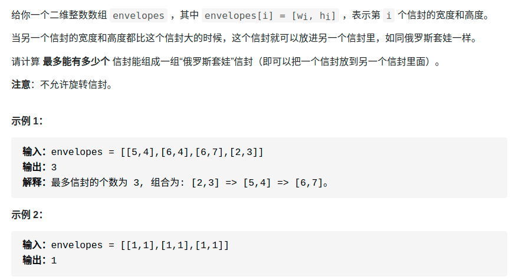
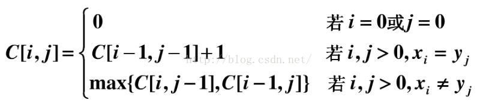
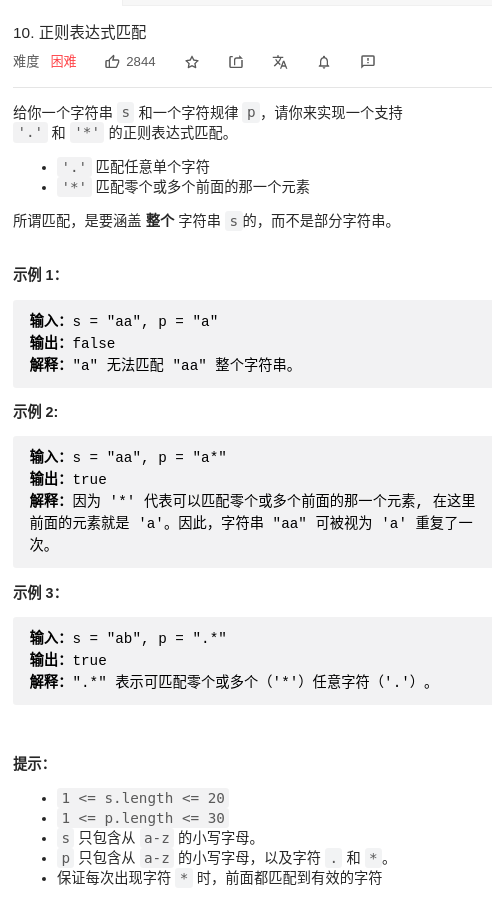

> 参考1：https://labuladong.gitbook.io/algo/mu-lu-ye-2/mu-lu-ye/dong-tai-gui-hua-xiang-jie-jin-jie    
- [概述](#概述)
  - [状态转移方程](#状态转移方程)
- [入门例子](#入门例子)
  - [斐波那契数列](#斐波那契数列)
  - [凑零钱（重点）](#凑零钱重点)
    - [最优子结构](#最优子结构)
    - [确定状态转移方程](#确定状态转移方程)
- [什么是最优子结构](#什么是最优子结构)
  - [最优子结构失效：改造问题](#最优子结构失效改造问题)
  - [最优子结构并不是动态规划独有的一种性质](#最优子结构并不是动态规划独有的一种性质)
- [经典例题](#经典例题)
  - [子序列类型问题](#子序列类型问题)
    - [模板](#模板)
      - [一维DP数组](#一维dp数组)
      - [二维DP数组](#二维dp数组)
    - [编辑距离](#编辑距离)
    - [300. 最长递增子序列（Longes Increasing Subsequence，简写为 LIS）](#300-最长递增子序列longes-increasing-subsequence简写为-lis)
    - [354. 信封嵌套问题](#354-信封嵌套问题)
    - [53. 最大子数组](#53-最大子数组)
    - [*1143.最长公共子序列(Longest Common Subsequence，简称 LCS)](#1143最长公共子序列longest-common-subsequence简称-lcs)
    - [516. 最长回文子序列](#516-最长回文子序列)
    - [152. 乘积最大子数组](#152-乘积最大子数组)
  - [背包问题](#背包问题)
  - [10. 正则表达式匹配](#10-正则表达式匹配)
# 概述
- **一般形式**：求最值，如最长递增子序列呀，最小编辑距离等等
- **核心问题**：穷举（特别的穷举）
- **特点（动态规划三要素）**：
  - 存在 **「重叠子问题」**
  - 具备 **「最优子结构」**：通过子问题的最值得到原问题的最值，**子问题间必须互相独立**
  - 存在 **「状态转移方程」**：只有列出正确的「状态转移方程」，**才能正确地穷举**
    - **写出状态转移方程是最困难的**


- **递归算法的时间复杂度**：就是用子问题个数乘以解决一个子问题需要的时间。

- **自顶向下**：一个规模较大的原问题比如说 f(20)，向下逐渐分解规模，直到 f(1) 和 f(2) 这两个 **base case**，然后逐层返回答案，这就叫 **「自顶向下」**。
- **自底向上**：从问题规模最小的  **base case** f(1) 和 f(2) 开始往上推，直到推到我们想要的答案 f(20)，**这就是动态规划的思路**，`这也是为什么动态规划一般都脱离了递归，而是由循环迭代完成计算`。

- dp数组的遍历方向，记住两点
  1. **过程**：遍历的过程中，所需的状态必须是已经计算出来的。
  2. **终点**：遍历的终点必须是存储结果的那个位置。

## 状态转移方程
- **写出状态转移方程是最困难的**，以下是思考状态转移方程的思维框架：
  - 明确 base case -> 明确「状态」-> 明确「选择」 -> 定义 dp 数组/函数的含义。
- 找状态转移需要归纳思维，说白了就是如何**从已知的结果推出未知的部分**。
- 框架代码：
```py
# 初始化 base case
dp[0][0][...] = base
# 进行状态转移
for 状态1 in 状态1的所有取值：
    for 状态2 in 状态2的所有取值：
        for ...
            dp[状态1][状态2][...] = 求最值(选择1，选择2...)
```
- 列出「状态转移方程」的重要性，它是**解决问题的核心**。而且很容易发现，**其实状态转移方程直接代表着暴力解法**。
  - 通过状态转移方程，写出暴力的代码
  - 剩下的也就是优化递归树，消除重叠子问题而已。

# 入门例子
## 斐波那契数列
- 「最优子结构」没有涉及，不是严格的动态规划，但是很好的说明了消除重叠子问题的方法。
- 改变过程：暴力 -> (画出递归树，时间复杂度o(2^n)，发现重叠子结构) -> 备忘录 -> (时间复杂度o(n),发现是自顶向下(递归)) -> 自底向上 -> (时间复杂度o(n),已从递归变循环，空间复杂度略高，且每次只用后两个记录)-> 状态压缩

<div align="center" style="zoom:60%"></div>

## 凑零钱（重点）
### 最优子结构
为什么说它符合**最优子结构**呢？比如你想求 `amount = 11` 时的最少硬币数（原问题），如果你知道凑出 `amount = 10` 的最少硬币数（子问题），你只需要把子问题的答案加一（再选一枚面值为 1 的硬币）就可能是原问题的答案。因为硬币的数量是没有限制的，所以子问题之间没有相互制，是互相独立的。


### 确定状态转移方程
1. **确定 base case**，这个很简单，显然目标金额 amount 为 0 时算法返回 0，因为不需要任何硬币就已经凑出目标金额了。
2. **确定「状态」，也就是原问题和子问题中会变化的变量**。由于硬币数量无限，硬币的面额也是题目给定的，只有目标金额会不断地向 base case 靠近，所以**唯一的「状态」就是目标金额 amount**。
3. **确定「选择」，也就是导致「状态」产生变化的行为**。目标金额为什么变化呢，因为你在选择硬币，你每选择一枚硬币，就相当于减少了目标金额。所以说所有硬币的面值，就是你的「选择」。
4. **明确 dp 函数/数组的定义**。我们这里讲的是自顶向下的解法，所以会有一个递归的 dp 函数，一般来说函数的参数就是状态转移中会变化的量，也就是上面说到的「状态」；函数的返回值就是题目要求我们计算的量。就本题来说，状态只有一个，即「目标金额」，题目要求我们计算凑出目标金额所需的最少硬币数量。所以我们可以这样定义 dp 函数：
   - dp(n) 的定义：输入一个目标金额 n，返回凑出目标金额 n 的最少硬币数量。

<div align="center" style="zoom:60%"></div>

# 什么是最优子结构
> https://mp.weixin.qq.com/s/qvlfyKBiXVX7CCwWFR-XKg

## 最优子结构失效：改造问题
- 符合最优子结构
```
我先举个很容易理解的例子：假设你们学校有 10 个班，你已经计算出了每个班的最高考试成绩。那么现在我要求你计算全校最高的成绩，你会不会算？当然会，而且你不用重新遍历全校学生的分数进行比较，而是只要在这 10 个最高成绩中取最大的就是全校的最高成绩。
```

- 不符合最优子结构
```
假设你们学校有 10 个班，你已知每个班的最大分数差（最高分和最低分的差值）。那么现在我让你计算全校学生中的最大分数差，你会不会算？可以想办法算，但是肯定不能通过已知的这 10 个班的最大分数差推到出来。因为这 10 个班的最大分数差不一定就包含全校学生的最大分数差，比如全校的最大分数差可能是 3 班的最高分和 6 班的最低分之差。
这次我给你提出的问题就不符合最优子结构，因为你没办通过每个班的最优值推出全校的最优值，没办法通过子问题的最优值推出规模更大的问题的最优值。前文 动态规划详解 说过，想满足最优子结，子问题之间必须互相独立。全校的最大分数差可能出现在两个班之间，显然子问题不独立，所以这个问题本身不符合最优子结构。
```
- **遇到这种最优子结构失效情况，怎么办？策略是：`改造问题`。**

```
改造问题，也就是把问题等价转化：最大分数差，不就等价于最高分数和最低分数的差么，那不就是要求最高和最低分数么，不就是我们讨论的第一个问题么，不就具有最优子结构了么？那现在改变思路，借助最优子结构解决最值问题，再回过头解决最大分数差问题，是不是就高效多了？
```

## 最优子结构并不是动态规划独有的一种性质
- 例子:求一棵二叉树的最大值，不难吧（简单起见，假设节点中的值都是非负数）：
```
int maxVal(TreeNode root) {
    if (root == null)
        return -1;
    int left = maxVal(root.left);
    int right = maxVal(root.right);
    return max(root.val, left, right);
}
```


# 经典例题
## 子序列类型问题
- 注意这里都是针对 `序列` ，而不是 `串`。
### 模板
- 参考：https://mp.weixin.qq.com/s/zNai1pzXHeB2tQE6AdOXTA

#### 一维DP数组
- 应用：最长递增子序列
```py
int n = array.length;
int[] dp = new int[n];

for (int i = 1; i < n; i++) {
    for (int j = 0; j < i; j++) {
        dp[i] = 最值(dp[i], dp[j] + ...)
    }
}
```

#### 二维DP数组
- 应用：
  - 涉及两个字符串/数组的子序列
    - eg:最长公共子序列。在子数组`arr1[0..i]`和子数组`arr2[0..j]`中，我们要求的子序列（最长公共子序列）长度为`dp[i][j]`。
  - 涉及一个字符串/数组
    - eg:最长回文子序列。在子数组`array[i..j]`中，我们要求的子序列（最长回文子序列）的长度为`dp[i][j]`。
```c++
int n = arr.length;
int[][] dp = new dp[n][n];

for (int i = 0; i < n; i++) {
    for (int j = 1; j < n; j++) {
        if (arr[i] == arr[j]) 
            dp[i][j] = dp[i][j] + ...
        else
            dp[i][j] = 最值(...)
    }
}
```

### 编辑距离
- 72.编辑距离：https://leetcode-cn.com/problems/edit-distance/
> 题目
```
给你两个单词 word1 和 word2，请你计算出将 word1 转换成 word2 所使用的最少操作数 。

你可以对一个单词进行如下三种操作：

插入一个字符
删除一个字符
替换一个字符

- 示例

输入：word1 = "horse", word2 = "ros"
输出：3
解释：
horse -> rorse (将 'h' 替换为 'r')
rorse -> rose (删除 'r')
rose -> ros (删除 'e')
```

> 思路
- **解决两个字符串的动态规划问题，一般都是用两个指针 i,j 分别指向两个字符串的最后，然后一步步往前走，缩小问题的规模。**
- 操作不只有三个，其实还有第四个操作，就是什么都不要做（skip）
- **怎么能一眼看出存在重叠子问题呢**？需要抽象出本文算法的递归框架：
  - 对于子问题 dp(i-1, j-1)，如何通过原问题 dp(i, j) 得到呢？有不止一条路径，比如 dp(i, j) -> #1 和 dp(i, j) -> #2 -> #3。一旦**发现一条重复路径**，就说明存在巨量重复路径，也就是重叠子问题。
```py
def dp(i, j):
    dp(i - 1, j - 1) #1
    dp(i, j - 1)     #2
    dp(i - 1, j)     #3
```
- **状态压缩**：既然每个 `dp[i][j]` 只和它附近的三个状态有关，空间复杂度是可以压缩成 O(min(M, N)) 的（M，N 是两个字符串的长度）
  - 但是可读性大大降低。
> 代码
```cpp
class Solution {
public:
    int minDistance(string word1, string word2) {
        vector<vector<int>> dp(505,vector<int>(505,1000));
        // 初始化
        for(int i = 0; i < 505; ++i){
            dp[i][0] = i;
            dp[0][i] = i;
        }
        // 状态1
        for(int i = 1; i <= word2.size(); ++i){
            // 状态2
            for(int j = 1; j <= word1.size(); ++j){
                if(word1[j-1] == word2[i-1])
                    dp[i][j] = min(dp[i-1][j-1],dp[i][j]); // skip
                else
                    dp[i][j] = min(dp[i-1][j-1]+1,dp[i][j]); // 换
                dp[i][j] = min(dp[i][j-1]+1,dp[i][j]); // 删
                dp[i][j] = min(dp[i-1][j]+1,dp[i][j]); // 增
            }
        }
        return dp[word2.size()][word1.size()];
    }
};
```

### 300. 最长递增子序列（Longes Increasing Subsequence，简写为 LIS）
> https://labuladong.gitbook.io/algo/mu-lu-ye-2/mu-lu-ye-1/dong-tai-gui-hua-she-ji-zui-chang-di-zeng-zi-xu-lie


- 最重要是要想到怎么定义DP table。

<div align="center" style="zoom:60%"></div>

```cpp
class Solution {
public:
    int lengthOfLIS(vector<int>& nums) {
        // 以num[i]为结尾时的最大递增子序列长度
        // base case = 1
        vector<int> dp(3000,1);
        for(int i = 0; i < nums.size(); ++i){
            for(int j = 0; j < i; ++j){
                if(nums[i] > nums[j])
                    dp[i] = max(dp[j]+1,dp[i]);
            }
        }

        int res = 0;
        for(int i = 0; i < nums.size(); ++i)
            res = res < dp[i] ? dp[i] : res;
        return res;
    }
};
```


### 354. 信封嵌套问题
> https://labuladong.gitbook.io/algo/mu-lu-ye-2/mu-lu-ye-1/xin-feng-qian-tao-wen-ti
- 354.俄罗斯套娃信封问题:https://leetcode-cn.com/problems/russian-doll-envelopes/
- 有点区间问题的味道
- 转化为 ： **最长递增子序列LIS**
- 这个解法的关键在于，对于宽度 w 相同的数对，**要对其高度 h 进行降序排序**。因为两个宽度相同的信封不能相互包含的，**逆序排序保证在 w 相同的数对中最多只选取一个**。

<div align="center" style="zoom:80%"></div>

### 53. 最大子数组
- 53.最大子序和：https://leetcode-cn.com/problems/maximum-subarray/
- 思路和最长递增子序列很像。
- 学了滑动窗口，回过来看，了解为什么不能用滑动窗口
  - https://labuladong.gitbook.io/algo/mu-lu-ye-2/mu-lu-ye-1/zui-da-zi-shu-zu
  - 因为没办法确定什么时候收缩窗口
<div align="center" style="zoom:80%"></div>

> 代码
```cpp
int maxSubArray(int[] nums) {
    int n = nums.length;
    if (n == 0) return 0;
    int[] dp = new int[n];
    // base case
    // 第一个元素前面没有子数组
    dp[0] = nums[0];
    // 状态转移方程
    for (int i = 1; i < n; i++) {
        dp[i] = Math.max(nums[i], nums[i] + dp[i - 1]);
    }
    // 得到 nums 的最大子数组
    int res = Integer.MIN_VALUE;
    for (int i = 0; i < n; i++) {
        res = Math.max(res, dp[i]);
    }
    return res;
}
```

### *1143.最长公共子序列(Longest Common Subsequence，简称 LCS)
- 参考：https://mp.weixin.qq.com/s/ZhPEchewfc03xWv9VP3msg
- 参考：https://blog.csdn.net/hrn1216/article/details/51534607

<div align="center" style="zoom:80%"></div>

- 相关题目:
  - 1143 583 712

- **最关键的一点**：若两个子串的最后一个字符是相同的，可以将其认为LCS一定包含该字符。如“bbaa”和“ba”，最后一个'a'一定包含在LCS（“ba”）中。

> 特征分析

- 设A=“a0，a1，…，am”，B=“b0，b1，…，bn”，且Z=“z0，z1，…，zk”为它们的最长公共子序列。不难证明有以下性质：
- 如果am=bn，则zk=am=bn，且“z0，z1，…，z(k-1)”是“a0，a1，…，a(m-1)”和“b0，b1，…，b(n-1)”的一个最长公共子序列；
- 如果am!=bn，则若**zk!=am**，蕴涵“z0，z1，…，zk”是“a0，a1，…，a(m-1)”和“b0，b1，…，bn”的一个最长公共子序列；
- 如果am!=bn，则若**zk!=bn**，蕴涵“z0，z1，…，zk”是“a0，a1，…，am”和“b0，b1，…，b(n-1)”的一个最长公共子序列。
<div align="center" style="zoom:80%"></div>

- 假如S1的最后一个元素 与 S2的最后一个元素相等，那么S1和S2的LCS就等于 {S1减去最后一个元素} 与 {S2减去最后一个元素} 的 LCS  再加上 S1和S2相等的最后一个元素。

- 假如S1的最后一个元素 与 S2的最后一个元素不等（本例子就是属于这种情况），那么S1和S2的LCS就等于 ： {S1减去最后一个元素} 与 S2 的LCS， {S2减去最后一个元素} 与 S1 的LCS 中的最大的那个序列。

> 状态转移方程
<div align="center" style="zoom:80%"></div>

### 516. 最长回文子序列
- 参考：https://mp.weixin.qq.com/s/zNai1pzXHeB2tQE6AdOXTA
  - 里面的图很详细形象

> 状态转移方程
```cpp
if (s[i] == s[j])
    // 它俩一定在最长回文子序列中
    dp[i][j] = dp[i + 1][j - 1] + 2;
else
    // s[i+1..j] 和 s[i..j-1] 谁的回文子序列更长？
    dp[i][j] = max(dp[i + 1][j], dp[i][j - 1]);
```
<div align="center" style="zoom:80%"></div>
<div align="center" style="zoom:80%"></div>

### 152. 乘积最大子数组

<div align="center" style="zoom:80%"></div>

- 定义：
  - `dp_max[i]`：以i作为结尾的最大乘积
  - `dp_min[i]`：以i作为结尾的最小乘积
- 表达式
  - 当`nums[i] < 0`: 要反过来，用最小的求最大的
    - `dp_max[i] = max(dp_min[i] * nums[i], nums[i])`
  - 当`nums[i] >= 0`: 
    - `dp_max[i] = max(dp_max[i] * nums[i], nums[i])`


```cpp

class Solution {
public:
    int maxProduct(vector<int>& nums) {
        // 以前一个为结尾，能达到的最大值和最小值
        // 重点： 当前最小要分为当前是负数还是正数
        // 正数情况 ：当前最大 = max(当前值， 当前值 * 前一个结尾的最大）
        // 负数情况 : 当前最大 = max(当前值， 当前值 * 前一个结尾的最小）
        int res = nums[0];
        int amax, amin;
        amax = nums[0];
        amin = nums[0];

        for(int i = 1; i < nums.size(); ++i){
            if(nums[i] < 0){
                // 重点：负数的时候，用前一个元素结尾的最大值 来求 当前元素结尾的最小。
                // 注意：nums[i] == -4 , amin == 3的情况，这个时候 nums[i] > amin*nums[i]
                auto t = max(amin*nums[i], nums[i]);
                amin = min(amax*nums[i], nums[i]);
                amax = t;
            }else{
                amax = max(amax*nums[i], nums[i]);
                amin = min(amin*nums[i], nums[i]);
            }
            res = max(amax, res);
        }
        return res;
    }
};
```
## 背包问题
- 01背包：https://labuladong.gitbook.io/algo/mu-lu-ye-2/mu-lu-ye-2/bei-bao-wen-ti
- 子集背包问题（01背包思想）：https://labuladong.gitbook.io/algo/mu-lu-ye-2/mu-lu-ye-2/bei-bao-zi-ji


## 10. 正则表达式匹配
- https://mp.weixin.qq.com/s/rnaFK05IcFWvNN1ppNf2ug

<div align="center" style="zoom:80%"></div>

- 正则表达算法问题只需要把住一个基本点：看两个字符是否匹配，**一切逻辑围绕匹配/不匹配两种情况展开即可**

- 「状态」无非就是i和j两个指针的位置，「选择」就是p[j]选择匹配几个字符
- 根据「状态」，我们可以定义一个dp函数
```cpp
class Solution {
public:
    bool isMatch(string s, string p) {
        auto res =  dp(s,0,p,0);
        return res;
    }
    unordered_map<string, bool> record;
    bool dp(string &s, int i, string &p, int j){
        cout << i << "," << j << endl;
        // base case
        if(j == p.size() && s.size() == i) return true;
        if(s.size() == i){
            // a 也能被 ab*c*匹配，所以要对这种特殊情况进行处理
            if((p.size()-j)%2 == 1)return false;
            for(int i = j; j < p.size(); j+=2){
                if(p[j+1] != '*') return false;
            }
            return true;
        }

        // trim
        if(record.count(std::to_string(i)+',' + std::to_string(j)))
            return record[std::to_string(i)+',' + std::to_string(j)];

        bool res = false;
        if(s[i] == p[j] || p[j] == '.'){
            if(j+1 < p.size()&&p[j+1] == '*')
                // 有 *，可以匹配 0 次或多次
                res = dp(s,i+1,p,j) || dp(s, i, p, j+2);
            else
                // 无 *，匹配一次
                res = dp(s,i+1,p,j+1);
        }else{
            if(j+1 < p.size()&&p[j+1] == '*')
                // 有 * ，可以匹配0次
                res =dp(s,i,p,j+2);
            else
                // 无 *，无法匹配
                res = false;
        }
        record[std::to_string(i)+',' + std::to_string(j)] = res;
        return res;
    }
};
```