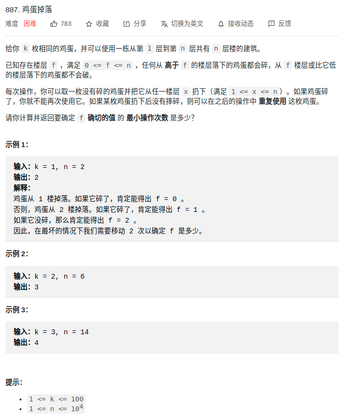
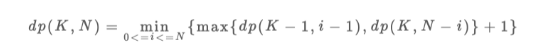
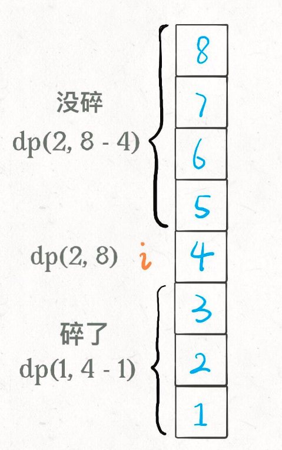
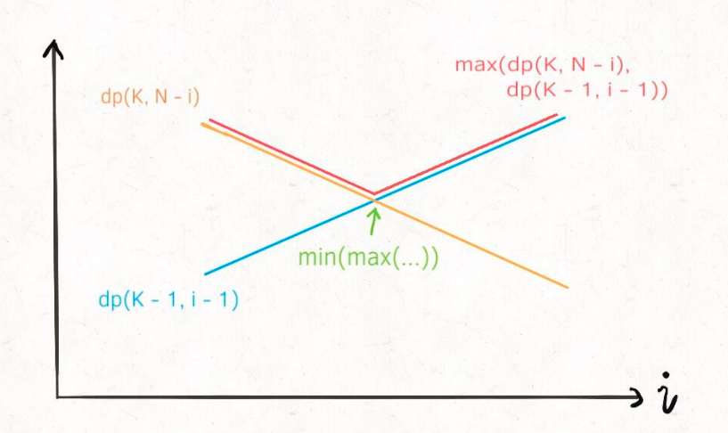
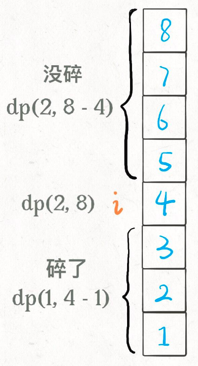

# 1. leetcode887_鸡蛋掉落



> 题目解析

- 求解的问题：**最坏**情况下，你**至少**要扔几次鸡蛋，才能**确定**这个楼层 `F` 呢？
  - 题目的问题实际上隐藏了最坏情况这个前提。
- **理解何为最坏情况下至少扔几次鸡蛋是关键**
  - （1个鸡蛋）**线性扫描**：**现在先不管鸡蛋个数的限制**（**假设只有一个**），比如有7层楼，线性扫描的方式就是一层层依次试，最坏情况就是 `F == 7`，**则最坏情况下至少扔7次**
    - **实际上只有一个鸡蛋的时候，就只能这样，这个情况将作为后面dp 的 *base case***
    - **最坏情况是**：**如果鸡蛋会碎，鸡蛋破碎一定发生在搜索区间穷尽时**
  - （无限个鸡蛋）**二分扫描**：**假设有无穷个鸡蛋**，二分查找是最好的，这个时候结果为最终  | [lo, hi] | == 1 时，扫描的次数
    - **最坏情况是**：**如果鸡蛋会碎，鸡蛋破碎一定发生在搜索区间穷尽时**
  - （限制K个鸡蛋）怎么办呢？
    - 二分肯定不行，那二分之后剩下一个就线性可以吗？
      - 不行，比如说把楼层变高一些，100 层，给你 2 个鸡蛋，你在 50 层扔一下，碎了，那就只能线性扫描 1～49 层了，最坏情况下要扔 50 次
    - 最优解其实是 14 次。最优策略非常多，而且并没有什么规律可言。

## 1.1 解法1：自顶向下的DP（函数表示DP）

- 状态：**当前拥有的鸡蛋数 `K` 和需要测试的楼层数 `N`**
  - 注意是楼层数
  - 可见是一个 **二维DP**
- 选择：**就是去选择哪层楼扔鸡蛋，选择性价比最高的那一层楼扔**
  - **特殊点：**
    - **这里的选择和其他题目有点不同，其需要遍历(需要for)所有可能的选择（假选择），最终选择一个性价比最高的（真选择）**
    - **而且选择后还会出现两种情况（简单的DP题目选择后只会出现一种情况），选择这两种情况（碎与没碎）中最坏的情况**
- base case：
  - K=1，N=i：线性扔，穷尽区间后才能最终确定 F
  - K=i，N=0：第0层一定不会碎

```python
def dp(K, N):
    if K == 1: return N
    if N == 0: return 0
```

- 状态转移方程：假设在第 i 层扔（做假设的选择），会出现两种情况：碎与不碎，选这两种情况中最坏的情况（**max**，由题意可知，正确的答案永远会在逃避我们的选择）

  - **如果鸡蛋碎了**，那么鸡蛋的个数 `K` 应该**减一**，搜索的楼层区间应该从 `[1..N]` 变为 `[1..i-1]` 共 `i-1` 层楼；
  
  - **如果鸡蛋没碎**，那么鸡蛋的个数 `K` 不变，搜索的楼层区间应该从 `[1..N]` 变为 `[i+1..N]` 共 `N-i` 层楼。
  
  - 最终的 `dp[K][N]` 为在所有能做的选择中，最坏情况下性价比最高的一个（**min**）
  
  - 
  
  - 代码体现：
  
    ```python
    def dp(K, N):
        for 1 <= i <= N:
            # 最坏情况下的最少扔鸡蛋次数
            res = min(res, 
                      max( 
                            dp(K - 1, i - 1), # 碎
                            dp(K, N - i)      # 没碎
                         ) + 1 # 在第 i 楼扔了一次
                     )
        return res
    
    ```
  





- 综上：加上备忘录，就是DP的解了，代码如下
  - **备忘录的Key 就是 DP 的状态，所以DP数组就是天然备忘录**
  - dp 函数：返回值为其表示值，参数为状态，内部代码做选择

```c++
def superEggDrop(K: int, N: int):
    memo = dict()
    def dp(K, N) -> int:
        # base case
        if K == 1: return N
        if N == 0: return 0
        # 避免重复计算
        if (K, N) in memo:
            return memo[(K, N)]

        res = float('INF')
        # 穷举所有可能的选择
        for i in range(1, N + 1):
            res = min(res, 
                      max(
                            dp(K, N - i), 
                            dp(K - 1, i - 1)
                         ) + 1
                  )
        # 记入备忘录
        memo[(K, N)] = res
        return res
    
    return dp(K, N)

```


- 时间复杂度：**动态规划算法的时间复杂度就是子问题个数 × 函数本身的复杂度**
  - 这里 `dp` 函数中有一个 for 循环，所以函数本身的复杂度是 O(N)
  - 子问题个数也就是不同状态组合的总数，显然是两个状态的乘积，也就是 O(KN)
  - 算法的总时间复杂度是 O(K*N^2), 空间复杂度 O(KN)


- 注：

  - 可能会将循环 `[1..N]` 和线性扫描混为一谈

    - 比方说你有 2 个鸡蛋，面对 10 层楼，你这次选择去哪一层楼扔呢？不知道，那就把这 10 层楼全试一遍。至于下次怎么选择不用你操心，有正确的状态转移，递归会算出每个选择的代价，我们取最优的那个就是最优解。

      


## 1.2 解法1：解法1的二分优化


- 为什么可以二分优化：
  - dp(K, N) 如果固定K，那么将是一个单调递增的函数，N越大，dp越大。
  - 那么注意 `dp(K - 1, i - 1)` 和 `dp(K, N - i)` 这两个函数，其中 `i` 是从 1 到 `N` 单增的，如果我们固定 `K` 和 `N`，**把这两个函数看做关于 `i` 的函数，前者随着 `i` 的增加应该也是单调递增的，而后者随着 `i` 的增加应该是单调递减的**：
  - **综上，满足二分查找应用到函数的性质**



```python
def superEggDrop(self, K: int, N: int) -> int:
        
    memo = dict()
    def dp(K, N):
        if K == 1: return N
        if N == 0: return 0
        if (K, N) in memo:
            return memo[(K, N)]
                            
        # for 1 <= i <= N:
        #     res = min(res, 
        #             max( 
        #                 dp(K - 1, i - 1), 
        #                 dp(K, N - i)      
        #                 ) + 1 
        #             )

        res = float('INF')
        # 用二分搜索代替线性搜索
        lo, hi = 1, N
        while lo <= hi:
            mid = (lo + hi) // 2
            broken = dp(K - 1, mid - 1) # 碎
            not_broken = dp(K, N - mid) # 没碎
            # res = min(max(碎，没碎) + 1)
            if broken > not_broken:
                hi = mid - 1
                res = min(res, broken + 1)
            else:
                lo = mid + 1
                res = min(res, not_broken + 1)

        memo[(K, N)] = res
        return res
    
    return dp(K, N)
```


- 时间复杂度：总时间复杂度是 O(K*N*logN), 空间复杂度 O(KN)


## 1.3 解法2：不一样的状态定义

- **DP问题，不同的状态定义，解法不同**：动态规划的状态转移本就是见仁见智，比较玄学的事情，不同的状态定义可以衍生出不同的解法，其解法和复杂程度都可能有巨大差异

- 解法1的DP如下：
  - 按照这个定义，就是**确定当前的鸡蛋个数和面对的楼层数，就知道最小扔鸡蛋次数**。最终我们想要的答案就是 `dp(K, N)` 的结果
  - **这种思路下，肯定要穷举所有可能的扔法的，用二分搜索优化也只是做了「剪枝」，减小了搜索空间，但本质思路没有变，还是穷举**

```python
def dp(k, n) -> int
# 当前状态为 k 个鸡蛋，面对 n 层楼
# 返回这个状态下最少的扔鸡蛋次数
```

```python
dp[k][n] = m
# 当前状态为 k 个鸡蛋，面对 n 层楼
# 这个状态下最少的扔鸡蛋次数为 m	
```

- 稍微修改 `dp` 数组的定义，**确定当前的鸡蛋个数和最多允许的扔鸡蛋次数，就知道能够确定 `F` 的最高楼层数**
  - 个人总结：当DP难以理解，可以用实例来实例化DP
  - 个人总结：**遇到DP时，是不是可以将所有维度的量，列出来；然后按 状态和结果，进行多种排列组合来思考，这样感觉结果就会自然显现**
    - **注意 同一个状态可能有不同解释，比如 是当前该操作的次数还是该操作的限制 / 是[1..i]该区间下的最优解还是以 i 为结尾的最优解**
    - **所以是先确定要哪种状态和结果组合，再确定状态是该维度的量的何种含义。**
  - 题目所要的结果变成了状态。题目不是**给你 `K` 鸡蛋，`N` 层楼，让你求最坏情况下最少的测试次数 `m`** 吗？`while` 循环结束的条件是 `dp[K][m] == N`，也就是**给你 `K` 个鸡蛋，测试 `m` 次，最坏情况下最多能测试 `N` 层楼**。

```python
dp[k][m] = n
# 当前有 k 个鸡蛋，可以尝试扔 m 次鸡蛋
# 这个状态下，最坏情况下最多能确切测试一栋 n 层的楼

# 比如说 dp[1][7] = 7 表示：
# 现在有 1 个鸡蛋，允许你扔 7 次;
# 这个状态下最多给你 7 层楼，
# 使得你可以确定楼层 F 使得鸡蛋恰好摔不碎
# （一层一层线性探查嘛）
```




- base case：
  - `dp[0][i]`：全为0
  - `dp[i][0]`：全为0
- 状态转移方程：
  - 基于两个事实：
    - **无论你在哪层楼扔鸡蛋，鸡蛋只可能摔碎或者没摔碎，碎了的话就测楼下，没碎的话就测楼上**
    - **无论你上楼还是下楼，总的楼层数 = 楼上的楼层数 + 楼下的楼层数 + 1（当前这层楼）**
  - `dp[k][m] = dp[k][m - 1] + dp[k - 1][m - 1] + 1`
    - **`dp[k][m - 1]` 就是楼上的楼层数**，因为鸡蛋个数 `k` 不变，也就是鸡蛋没碎，扔鸡蛋次数 `m` 减一；
    - **`dp[k - 1][m - 1]` 就是楼下的楼层数**，因为鸡蛋个数 `k` 减一，也就是鸡蛋碎了，同时扔鸡蛋次数 `m` 减一。


- 综上，代码如下所示

```java
int superEggDrop(int K, int N) {
    // m 最多不会超过 N 次（线性扫描）
    int[][] dp = new int[K + 1][N + 1];
    // base case:
    // dp[0][..] = 0
    // dp[..][0] = 0
    // Java 默认初始化数组都为 0
    int m = 0;
    while (dp[K][m] < N) {
        m++;
        for (int k = 1; k <= K; k++)
            dp[k][m] = dp[k][m - 1] + dp[k - 1][m - 1] + 1;
    }
    return m;
}
```


